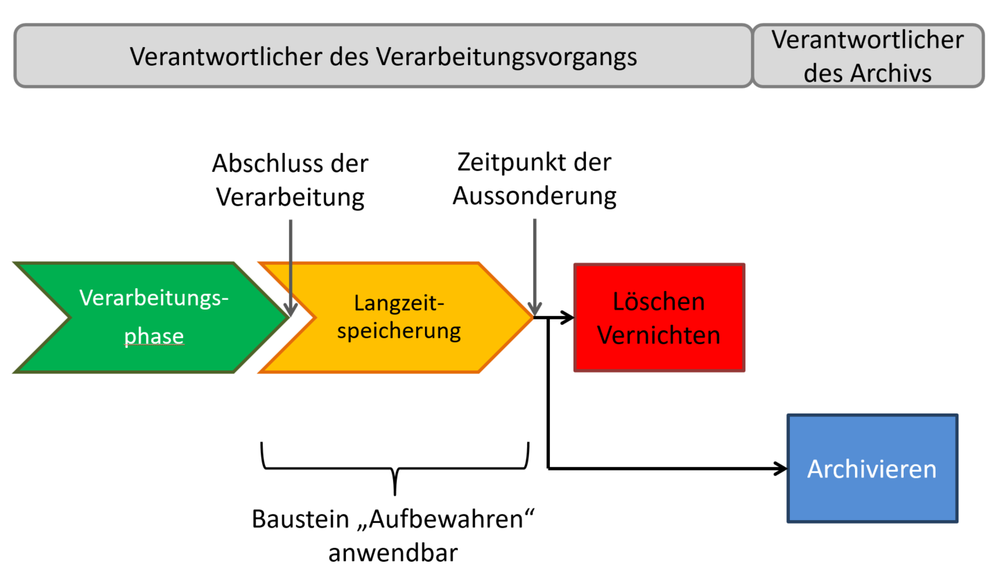

# Baustein 11 „Aufbewahren“ 

> Version: V1.0

Bezugsquelle: https://www.datenschutz-mv.de/datenschutz/datenschutzmodell/ 

## Versionshistorie 

> SDM-V2.0_Aufbewahren_V1.0 
>
> gültig seit: 6.10. 2020 
>
> gültig bis:

## 1. Bezug zu den Anforderungen der DS-GVO und den Gewährleistungszielen 

Dieser Baustein dient vorrangig der Umsetzung folgender DS-GVO-Anforderungen (vgl. SDM-V2b-Methodik-Handbuch, Teil B): 

| Anforderungen der DS-GVO                         | Gewährleistungsziele |
|--------------------------------------------------|----------------------|
| Verfügbarkeit (Art. 5 Abs. 1 lit. e DS-GVO)      | Verfügbarkeit        |
| Integrität (Art. 5 Abs. 1 lit. f DS-GVO)         | Integrität           |
| Vertraulichkeit (Art. 5 Abs. 1 lit. f DS-GVO)    | Vertraulichkeit      |
| Speicherbegrenzung (Art. 5 Abs. 1 lit. e DS-GVO) | Datenminimierung     |

## 2. Beschreibung 

Personenbezogene Daten müssen gespeichert werden, um sie vom Zeitpunkt der Erhebung über die gesamte rechtlich zulässige und ggf. die verpflichtende Speicherdauer bis zum Zeitpunkt der Aussonderung (Abgabe an Archive, Löschung oder Vernichtung) zur Verarbeitung bereitzustellen. 

Speicherung umfasst das Erfassen, Aufnehmen und Aufbewahren von Daten. Die Speicherung personenbezogener Daten für einen bestimmten Zweck ist nur so lange und nur in dem Umfang zulässig, wie eine Rechtsgrundlage dies erlaubt (Art. 5 Abs. 1 DS-GVO). Dies ist durch geeignete technische und organisatorische Maßnahmen sicherzustellen (Art. 24, 25 und 32 DS-GVO). Betroffen sind einerseits Daten, die für den laufenden Bearbeitungsprozess ständig zur Verfügung stehen müssen (z. B. Patientendaten zur Erfüllung des mit Patienten abgeschlossenen Behandlungsvertrages während der medizinischen Behandlung im Krankenhaus oder Vertragsunterlagen zur Erfüllung handels- und steuerrechtlicher Anforderungen). Andererseits sind solche Daten betroffen, die für das tägliche Geschäft nicht mehr erforderlich sind, aufgrund rechtlich gebotener Speicherpflichten aber noch nicht gelöscht werden dürfen und die möglicher Weise auch außerhalb des Produktionssystems aufbewahrt werden (z. B. Patientendaten nach abgeschlossener medizinischer Behandlung, die u. a. zur Erfüllung der ärztlichen Dokumentationspflicht weiter aufbewahrt werden müssen oder Vertragsunterlagen, welche aus handels- und steuerrechtlichen Gründen auch nach Erfüllung des Vertrags aufbewahrt werden müssen). Damit sind Speicherfristen von wenigen Sekunden (z. B. Prüfung einer IP-Adresse gegen eine Regel oder Blockliste in einer Firewall) bis hin zu vielen Jahrzehnten (bspw. Personenstandsregister: Fristen von 80 Jahren für Eheregister und Lebenspartnerschaftsregister, von 110 Jahren für Geburtenregister und von 30 Jahren für Sterberegister) möglich. 

Der Baustein „Aufbewahren“ beschreibt diejenigen Maßnahmen zur Speicherung von personenbezogenen Daten, die zum Aufbewahren in physikalischen Speichermedien (Datenträgern) über längere Zeiträume (Langzeitspeichersystem) erforderlich sind, um auf sie während des gesamten Aufbewahrungszeitraums zugreifen zu können. Der Begriff Aufbewahren wird in diesem Baustein für die langfristige Informationserhaltung von Datenobjekten mit Personenbezug verwendet. 

Nicht betrachtet wird dagegen das Aufbewahren von Daten in Form von Datensicherungen, die mit dem Ziel gespeichert werden, Datenbestände bei Verlust wiederherstellen zu können (Backups). Ebenfalls nicht betrachtet wird das Archivieren von Unterlagen mit personenbezogenen Daten, bei der die Abgabe von Unterlagen an Archive gesondert gesetzlich geregelt ist. Das Archivieren umfasst die Bewertung archivreifer und die Übernahme archivwürdiger Unterlagen, deren Erschließung, dauerhafte Verwahrung und Erhaltung als künftiges Archivgut sowie die Bereitstellung der Unterlagen für die Benutzung. Mit der Archivierung auf der Grundlage spezieller Archivgesetze geht die datenschutzrechtliche Verantwortung für die in den Unterlagen befindlichen personenbezogenen Daten vom bisher zuständigen Verantwortlichen auf den für das Archiv Verantwortlichen über. In der Informationstechnik wird der Datenbestand, der für den laufenden Verarbeitungsprozess nicht mehr ständig zur Verfügung stehen muss, häufig ebenfalls als „Archiv“ bezeichnet. Jedoch ist dieses Verständnis von einer Archivierung im Sinne der Archivgesetze des Bundes und der Länder abzugrenzen. 

Aufzubewahrende Daten zählen somit zum Produktivdatenbestand, auch für den Fall, dass diese für den operativen Betrieb nicht mehr erforderlich sind oder dass ihre Verarbeitung gem. Art. 18 Abs. 1 DS-GVO eingeschränkt wurde. Sie MÜSSEN weiterhin im erforderlichen Umfang verarbeitet werden können. Dabei ist sicherzustellen, dass die Daten verfügbar und integer bleiben, auch wenn sich zwischenzeitlich Hardware und Software oder Geschäftsprozesse ändern. Um einen Überblick über die aufzubewahrenden Daten zu bekommen, MUSS zunächst eine Inventur aller vorhandenen Daten-Formate durchgeführt werden (M11.D01). 

Eine anhaltende Verfügbarkeit kann durch eine oder durch Kombination von mehreren der folgenden Maßnahmen sichergestellt werden: 

a) Die Datenobjekte werden auf Papier ausgedruckt, welches dann sicher aufbewahrt wird (M11.S01). 

Der Ausdruck auf Papier ist langfristig nicht mit den Forderungen der E-GovernmentGesetze von Bund und Ländern nach Digitalisierung, elektronischer Aktenführung und mit den Bestrebungen von Verwaltung und Wirtschaft nach effizienten, elektronischen Geschäftsprozessen vereinbar. Diese Methode kommt deshalb nur in Betracht, wenn (elektronische) Datenobjekte nicht in ihrer originären Form aufbewahrt werden müssen. Sie wird in Zukunft an Bedeutung verlieren, kann aber für kleine Datenvolumen und für einen zeitlich überschaubaren Übergangszeitraum zumindest in Betracht gezogen werden. 

b) Die bei der erstmaligen Speicherung verwendeten Systeme (Hardware, Betriebssystem, Software-Werkzeuge) bzw. die dazu kompatiblen Systeme (z. B. die letzte Softwareversion, die ein Dokumentenformat noch öffnen kann) müssen vorgehalten und für die Dauer des Aufbewahrens gepflegt werden (M11.S02). Da der Aufwand bei einer steigenden Menge an vorzuhaltenden Systemen zunimmt und auch Lizenzfragen bei der Nutzung von ggf. „alter“ Software zu beachten sind, ist dieser Ansatz allenfalls nur als begründete und zeitlich begrenzte Übergangslösung zu empfehlen. 

Hilfreich können Emulations- oder Virtualisierungstechniken sein, die es erlauben, veraltete Betriebssysteme und Anwendungssoftware auf moderner Hardware zu emulieren bzw. lauffähig zu halten (M11.S03). Abhängig von der eingesetzten Technik ergeben sich wiederum daraus resultierende eigenständige Anforderungen in Bezug auf Datensicherheit und Umsetzung der datenschutzrechtlichen Gewährleistungsziele. 

Falls veraltete Systeme vorgehalten werden, MUSS ergänzend geprüft werden, wie der zusätzlichen Gefährdung begegnet werden kann, die aus diesen Hard- und Softwarekomponenten resultiert, die in der Regel nicht mehr dem Stand der Technik entsprechen. Dabei ist zu bedenken, dass für solche Komponenten von den Herstellern regelhaft keine Sicherheitspatches mehr bereitgestellt werden. Daher gilt es u. a., Zugriffsmöglichkeiten insbesondere von außerhalb eines gesicherten Netzwerkes möglichst restriktiv zu handhaben bzw. vollständig zu unterbinden (M11.S04). 

c) Die Datenobjekte können mit Beginn des Aufbewahrens (und ggf. zusätzlich von Zeit zu Zeit währenddessen) in neue digitale Repräsentationen überführt werden (Transformation, Format-Migration (M11.S05)). Das neue Datenobjekt muss dabei ein vollwertiger Ersatz für das alte sein. Deshalb ist sicherzustellen, dass alle signifikanten Eigenschaften der Informationsobjekte erhalten und dass im Zuge des Überführens sämtliche Gewährleistungsziele eingehalten werden, also bspw. weder die Integrität der Daten noch die Zweckbindung oder Vertraulichkeit des Datenbestandes gefährdet ist. 

Diese Variante ist aus datenschutzrechtlicher Sicht zu empfehlen, da es hier keine Abhängigkeit von einer Vielzahl unterschiedlicher Komponenten gibt und die Datenobjekte in ein Standardformat überführt werden. Sie sind damit unabhängig von der Soft- und Hardwareumgebung, in der sie entstanden sind. 

Während des gesamten Zeitraums des Aufbewahrens von personenbezogenen Daten MUSS gewährleistet sein, dass die Daten lesbar sind und durch den Verantwortlichen oder den Auftragsverarbeiter im jeweils erforderlichen Umfang weiterverarbeitet werden können. Dadurch soll den Grundsätzen der Verfügbarkeit und der Integrität sowie den Anforderungen, die sich aus den Betroffenenrechten ergeben (Intervenierbarkeit), jederzeit genügt werden können. Dies erfordert entsprechende Festlegungen für Daten (Inhalts- und Metadaten sowie Verifikationsdaten wie Signaturzertifikate und Zeitstempel), für die technischen Systeme und für die dazugehörigen Prozesse. 

### Daten 

Der Verantwortliche MUSS für den Zeitraum des Aufbewahrens personenbezogener Daten für alle Inhaltsdaten die Datenformate, die Syntax und die Semantik detailliert festlegen und dokumentieren (M11.D02). Bei der Wahl der Datenformate ist anzustreben, dass die Daten plattform- und herstellerunabhängig, eindeutig interpretierbar und für die Dauer der gesetzlichen Aufbewahrungsfristen in entsprechenden technischen Systemen verarbeitet werden können. Empfehlenswert wäre es dabei, wenn die Spezifikationen standardisiert und öffentlich zugänglich sind. Für eine langfristige Ablage der Inhaltsdaten von Dokumenten (originär digital erzeugt oder digitalisiert) sind bspw. Formate wie PDF/A, Text (ASCII), ODF, TIFF, JPEG oder PNG geeignet. 

Damit die Eigenschaften der Informationsobjekte nach der Überführung in neue digitale Repräsentationen erhalten bleiben, MUSS der Verantwortliche frühzeitig definieren, welche die „signifikanten Eigenschaften“ der im Langzeitspeicher abzulegenden Dokument-Typen, ihre zukünftige Ziel- oder Nutzergruppe sowie die Art der zukünftigen Verwendung sind (M11.D03). Beispielsweise ist zu entscheiden, ob beim ersetzten Scannen von Schriftstücken Farbinformationen relevant sind. 

Neben den Inhaltsdaten sind Metadaten erforderlich, die einerseits helfen, die Ursprungsdaten aufzufinden und andererseits sicherstellen, dass aus Repräsentationen und ihren Daten für den Menschen interpretierbare Informationsobjekte wiederhergestellt werden. Das betrifft bspw. 

* „beschreibende Metadaten“ wie Aktenzeichen, Betreff oder Bezug, 
* „technische Metadaten“ wie Dateiname, Dateiformat, Dateigröße, Hashwerte (Signaturen), in der Ausgangsdatei eingebettete Metadaten oder bei Erstellung verwendete bzw. zur Nutzung notwendige Softwareumgebungen oder 
* „administrative Metadaten“ mit Angaben, um die Verwaltung und die Nutzung der Objekte nachvollziehen zu können. 

Für den Zeitraum des Aufbewahrens MUSS festgelegt werden, welche Metadaten in welchen Formaten im Zusammenhang mit den Inhaltsdaten gespeichert werden (M11.D04). Für eine langfristige Ablage der Metainformationen sind aktuell die Formate XML in Verbindung mit XSD- oder JSON geeignet. Bei der Verwendung dieser Formate sind die Schemata, die die Struktur der genutzten Datenfelder und -typen beschreiben, zu dokumentieren und für die Dauer der Aufbewahrung zu speichern (M11.D05). 

In bestimmten Fällen ist der Beweiswert von Daten während des Zeitraums des Aufbewahrens zu erhalten (bspw. bei Dokumenten mit Urkundencharakter). Insbesondere hinsichtlich der Sicherung der Authentizität der kryptographisch signierten Daten (signierten, gesiegelten bzw. zeitgestempelten) muss langfristig nachweisbar sein, wem die elektronische Signatur bzw. das elektronische Siegel bzw. der elektronische Zeitstempel zugerechnet werden kann. Der Urheber der kryptographisch signierten Daten muss eindeutig erkennbar sein. Die für eine langfristige Aufbewahrung elektronischer Daten erforderlichen Vorkehrungen zur Sicherung der Authentizität, die in der eIDAS-Verordnung [eIDAS-VO, Artikel 34] und [ETSI SR 019 510], [ETSI TS 119 511] und [ETSI TS 119 512] sowie im Vertrauensdienstegesetz [VDG, § 13 und § 15] enthalten sind, MÜSSEN umgesetzt werden (M11.D06; siehe dazu BSI TR-ESOR – 03125 Abschnitt 4.2.1.1). 

### Systeme und Dienste 

Damit der Verantwortliche die datenschutzrechtlichen Anforderungen erfüllen kann, müssen die datenschutzrechtlichen Erfordernisse auf Systemen und Diensten abgebildet werden können. Die technischen Systeme MÜSSEN in der Lage sein, Inhalts-, Meta- und Verifikationsdaten für den gesamten Zeitraum des Aufbewahrens zu erhalten. Zu diesem Zweck sind Maßnahmen erforderlich, die zum Erhalt der im Speichersystem auf physikalischen Speichermedien abgelegten digitalen Objekte geeignet sind. Sofern nicht sichergestellt werden kann, dass die Software- und Hardwareumgebung, in der die Datenobjekte entstanden sind (Quellsystem), mittel- und langfristig noch verfügbar sind, müssen die Datenobjekte der Art ausgestaltet sein, dass sie unabhängig vom Quellsystem genutzt werden können. 

Die folgenden technischen Maßnahmen können einzeln oder in Kombination dazu beitragen, eine dauerhafte physikalische Speicherung und erneute Verarbeitung zu gewährleisten: Erhalten der Lauffähigkeit veralteter Software (Betriebssysteme, Anwendungssoftware) durch Virtualisierung oder Emulation (M11.S03) redundante Vorhaltung der Datenbestände („Replikation“ - M11.S06) räumlich verteilte Speicherung der Daten (M11.S07) 

* Erhalten der Lauffähigkeit veralteter Software (Betriebssysteme, Anwendungssoftware) durch Virtualisierung oder Emulation (M11.S03)
* redundante Vorhaltung der Datenbestände („Replikation“ - M11.S06)
* räumlich verteilte Speicherung der Daten (M11.S07)
* parallele Nutzung unterschiedlicher Speichersysteme („Diversität“ - M11.S08)
* regelmäßiges Ersetzen von Datenträger- und Speichersystemen („Refreshment“ - M11.S09)
* regelmäßige Migration auf andere Speichersysteme (M11.S10)
* Gewährleistung der Echtheit und Unverfälschtheit von Datenobjekten beim Abruf von Nachweisen, indem die Middleware sämtliche hierfür erforderliche elektronische Nachweise erstellt und zurückgibt (M11.S11)
* Sicherungs- und Rücksicherungs-Verfahren und -techniken („Sicherung & Rücksicherung“ - M11.S12)
* Umsetzung von Maßnahmen, mit denen gesetzlich geforderte Mandantentrennungen bei einer erneuten Nutzung der Daten gewährleistet werden (M11.S13)
* Maßnahmen zum Erhalt der Lesbarkeit, Vollständigkeit, Integrität und Authentizität, der im Langzeitspeicher verbleibenden Dokumente nach dem Löschen anderer aufbewahrter Dokumente (M11.S14)
* Protokollierungs-Systeme (siehe Baustein 43 Protokollieren)

### Prozesse 

Der Verantwortliche MUSS organisatorische Prozesse vorhalten, die regeln, wer nach welchen Vorgaben und nach welchen rechtlichen Kriterien die Aufbewahrungsdauer festlegt (M11.P01). Im Berechtigungs- und Rollenkonzept MÜSSEN die Spezifika während der Aufbewahrungsdauer ausgewiesen werden. Bei Änderungen der rechtlichen Rahmenbedingungen ist in der Regel eine Anpassung bzw. Aktualisierung der organisatorischen Prozesse und ggf. daraus resultierend auch der Systeme und Dienste erforderlich. Zudem MUSS einmalig im Rahmen der Planung der Datenverarbeitung und danach anlassbezogen etwa bei neuer Spezifikation von Speicherformaten oder bei Veränderung der Verarbeitungssoftware für die Übernahme der Daten in den Langzeitspeicher eine Inventur der vorhandenen Formate durchgeführt werden. Auf der Basis dieser Inventur sind Kriterien für die Auswahl der technischen Systeme und Dienste zur Erhaltung der Daten (M11.P02) und der Zeitpunkt der Konvertierung in das Format zur Langzeitspeicherung bzw. der Migration auf/in andere Speichersysteme zu definieren (M11.P03). Dafür benutzte Konvertierungstools MÜSSEN die Integrität der Daten gewährleisten (M11.P04), dies sollte regelmäßig und bei Änderungen der Konvertierungstools überprüft und dokumentiert werden. In diesem Zusammenhang sind auch Prozesse zu definieren, die den Umgang mit versionierten Daten steuern (M11.P05). 

Ein Dokumentationsprozess MUSS sicherstellen, dass auch bei langfristiger Aufbewahrung jederzeit nachvollzogen werden kann, welche Hard- und Software erforderlich ist, um die Daten verarbeiten zu können. Jede Formatkonvertierung und jede Migration auf andere Speichersysteme MUSS protokolliert werden (siehe Baustein Protokollierung). Dabei ist zu dokumentieren, ob und ggf. wie sich die Zieldaten von den Quelldaten unterscheiden (z. B. Reduzierung der Auflösung, Farbtiefe, Auslagerung von Meta-Informationen in ein Sidecar File[^1]) und welche die Integrität gefährdenden, manipulierenden Operationen an den digitalen Objekten durchgeführt wurden (M11.P06). 

[^1]: Sidecar-Dateien (auch bekannt als Buddy-Dateien) sind Dateien, die Daten (oft Metadaten) in einem anderen Format als das der Quelldatei speichern. Sidecar-Dateien haben i. d. R. den gleichen Basisnamen wie die Quelldatei, aber mit einer anderen Erweiterung.

Der Verantwortliche MUSS technische und organisatorische Prozesse spezifizieren und implementieren, mit denen die Wiederherstellung von Daten binnen vorgegebener Fristen möglich ist (M11.P07, M11.P08). Dies ist Voraussetzung, um sowohl ein nachträgliches Ändern aufbewahrter Daten (Berichtigen, Löschen, Einschränken der Verarbeitung) – bspw. als Folge der Intervention betroffener Personen – als auch die Auskunft an betroffene Personen bezüglich ihrer gespeicherten Daten technisch und organisatorisch zu gewährleisten. 

Sofern das Löschen von Daten und Dokumenten vor Ablauf des gesetzlich vorgeschriebenen Aufbewahrungszeitraums zulässig ist, MUSS dies durch organisatorisch berechtigte Nutzer angestoßen sowie durch entsprechende Protokolle dokumentiert und begründet werden. Auch das Löschen von Daten und Dokumenten nach Ablauf des gesetzlich vorgeschriebenen Aufbewahrungszeitraums (Ende der maximal zulässigen Speicherdauer) kann durch organisatorisch berechtigte Nutzer angestoßen werden, oder durch einen zentralen Prozess, der diese Funktion für den gesamten aufbewahrten Datenbestand ausführt und entsprechend berechtigt ist (M11.P09). Nach Möglichkeit sollten diese Prozesse mit Hilfe einer technisch berechtigten vorgelagerten IT-Anwendung erfolgen. 

## 3. Differenzierung bei hohem Schutzbedarf 

Zum einen ist in der Regel dann von hohem Schutzbedarf auszugehen, wenn der Beweiswert von Daten während des Zeitraums des Aufbewahrens erhalten werden muss (bspw. bei der elektronischen Speicherung von Urkunden oder Verwaltungsakten). Durch zusätzliche physische Sicherungsmaßnahmen MÜSSEN die IT-Infrastruktur zur nachweiserhaltenden Aufbewahrung und die entsprechenden Speichermedien vor Verlust, Zerstörung sowie unberechtigter Veränderung geschützt werden, etwa durch Unterbringung der technischen Komponenten in zertifizierten Hochsicherheitsrechenzentren (M11.S15). 

Für Daten mit hohem Schutzbedarf MÜSSEN regelmäßig Inventurprozesse angestoßen werden um sicherzustellen, dass der Beweiswert nicht durch veraltete kryptographische Verfahren verloren geht. 

So gelten bspw. für die Führung der (elektronischen) Personenstandsregister Fristen von 80 Jahren für Eheregister und Lebenspartnerschaftsregister, von 110 Jahren für Geburtenregister und von 30 Jahren für Sterberegister (§ 5 Abs. 5 PStG). Die Verarbeitung von Daten dieser Register führt zu einem besonders hohen Risiko und somit zu einem besonders hohen Schutzbedarf betroffener Personen, da sie dem dauerhaften Nachweis von Eheschließung, 

Begründung der Lebenspartnerschaft, Geburt und Tod dienen. Die Datenverarbeitungsverfahren für die Personenstandsregister (Registerverfahren) müssen daher u. a. gewährleisten, dass die Beurkundungsdaten als Personenstandseintrag auf Dauer unveränderbar gespeichert und dass die erforderliche dauerhaft überprüfbare qualifizierte elektronische Signatur und die Daten, die zur Sicherung der dauerhaften Überprüfbarkeit erforderlich sind, beim Personenstandseintrag gespeichert werden. 

Zum anderen ist in der Regel auch dann hoher Schutzbedarf gegeben, wenn besondere Kategorien personenbezogener Daten (Art. 9 Abs. 1 DS-GVO) umfangreich verarbeitet werden oder bei Daten, die einem Amts- oder Berufsgeheimnis unterliegen. Dazu gehören bspw. Daten medizinischer Behandlungen (behandlungsbezogene Dokumente), die gemäß der Berufsordnung für die in Deutschland tätigen Ärztinnen und Ärzte für die Dauer von zehn Jahren nach Abschluss der Behandlung aufzubewahren sind (§ 10 Abs. 3 MBO-Ä 1997). 

Bei hohem Schutzbedarf hinsichtlich der Vertraulichkeit ist eine verschlüsselte Speicherung durchzuführen (M11.D07). Zur Gewährleistung einer gesteigerten Verfügbarkeit KANN bspw. der oben erwähnte Mechanismus der Sidecar-Dateien beitragen (M11.D08). Um die Integrität auch bei hohem Schutzbedarf gewährleisten zu können, sind der Einsatz von Fehlerkorrekturverfahren bei der Datenspeicherung (M11.D09), Integritäts- und Signaturprüfungen bei Datenbanken, Betriebssystemen und Programmen (M11.S16) sowie besondere Zugriffskontrollmechanismen (z. B. Identitätsmanagementsysteme – M11.S17, Zwei-Faktor-Authentisierung – M11.S18) angezeigt. 

Bei hohem Schutzbedarf ist die Prüfung der Wirksamkeit der eingesetzten Maßnahmen besonders sorgfältigen durchzuführen. Beispielsweise sind an die Prozesse und Dienste, die die Verfügbarkeit, Integrität und Vertraulichkeit der Daten nach einer Migration auf andere Speichersysteme prüfen, besonders hohe Anforderungen hinsichtlich ihrer ordnungsgemäßen Funktion zu stellen. Beim Einsatz von Virtualisierungs- und Emulationstechniken MUSS der Verantwortliche durch geeignete Trennungen sicherstellen, dass die Nichtverkettung auch auf einem Hostsystem nicht unterlaufen wird. Zudem sind regelmäßige Tests auf Verfügbarkeit und Lesbarkeit angebracht. Die gewählte Aufbewahrungsstrategie MUSS dokumentiert sein und die Speicherungsorte SOLLTEN ausdrücklich festgelegt sein. 

## 4. Referenzen

IT-PLR:

Nationale Langzeitspeicherung (NaLa): http://www.it-planungsrat.de/DE/Projekte/AbgeschlosseneProjekte/NaLa/NaLa_node.html

BSI:

TR-03125 (TR-ESOR - Beweiswerterhaltung kryptographisch signierter Dokumente)

DIN:

DIN 31644:2012-04 (Kriterien für vertrauenswürdige digitale Langzeitarchive)

DIN 31645:2011-11 (Leitfaden zur Informationsübernahme in digitale Langzeitarchive)

DIN 31647:2015-05 (Beweiswerterhaltung kryptographisch signierter Dokumente)

ISO:

ISO 14721:2012 OAIS Version 2 vom August 2012 (Referenz-Modell für Komponenten, Abhängigkeiten, Funktionen und Prozesse für Lösungen zur Langzeitspeicherung)

## 5. Zusammenfassung der Maßnahmen 

Die einzelnen Maßnahmen können hinsichtlich des Anwendungsbereichs unterschieden werden nach Maßnahmen, welche primär auf einzelne Verarbeitungen angewandt werden sollten (kursive Darstellung) und solche, welche primär die gesamte Organisation betreffen und damit im Rahmen des Datenschutzmanagements gebündelt und verwaltet werden sollten. Weiterhin sind alle Maßnahmen grob den PDCA-Phasen des Datenschutzmanagement-Prozesses (siehe SDM-Methode) zugordnet. Maßnahmen, die in früheren Versionen des Bausteins enthalten waren, aber in einer nachfolgenden Version ungültig wurden, werden weiterhin aufgeführt (durchgestrichene Darstellung). Damit bleibt die Nummer einer Maßnahme bei einer neuen Version erhalten. Die Spalte „Gültigkeit“ gibt an, seit welcher Version die Maßnahme in der enthaltenen Form gültig ist. Bei ungültigen Maßnahmen enthält diese Spalte die Versionsnummer des Bausteins, in der die Maßnahme letztmalig gefordert bzw. empfohlen wurde. 

### Ebene Daten

| Nr.     | Maßnahme                                                                                                                                                                          | PDCA                                             | Gültigkeit |      |
|---------|-----------------------------------------------------------------------------------------------------------------------------------------------------------------------------------|--------------------------------------------------|------------|------|
| M11.D01 | Inventur aller vorhandenen Daten-Formate vor dem Aufbewahren                                                                                                                      | P, D                                             | V1.0       |      |
| M11.D02 | Festlegung und Dokumentation geeigneter Datenformate für die aufzubewahrenden Daten                                                                                               | P                                                | V1.0       |      |
| M11.D03 | Definition der signifikanten Eigenschaften der im Langzeitspeicher abzulegenden Dokument-Typen, ihrer zukünftige Ziel- oder Nutzergruppe sowie der Art der zukünftigen Verwendung | P                                                | V1.0       |      |
| M11.D04 | Festlegung von Art, Umfang und Format der mit aufzubewahrenden Metadaten                                                                                                          | P                                                | V1.0       |      |
| M11.D05 | Dokumentation und Archivierung der Schemata, welche die Struktur der genutzten Datenfelder und -typen beschreiben                                                                 | P                                                | V1.0       |      |
| M11.D06 | Einhaltung der Vorkehrungen der eIDAS-Verordnung sowie des Vertrauensdienstegesetzes zur Sicherung der Authentizität und des Beweiswertes von Daten                               | P                                                | V1.0       |      |
| M11.D07 | Verschlüsselung gespeicherter Daten                                                                                                                                               | P, D                                             | V1.0       |      |
| M11.D08 | Verwendung von Sidecar-Dateien                                                                                                                                                    | P, D                                             | V1.0       |      |
| M11.D09 | Fehlerkorrekturverfahren bei der Datenspeicherung                                                                                                                                 | P, D                                             | V1.0       |      |

### Ebene Systeme und Dienste

| Nr.     | Maßnahme                                                                                                                                                                          | PDCA                                             | Gültigkeit |      |
|---------|-----------------------------------------------------------------------------------------------------------------------------------------------------------------------------------|--------------------------------------------------|------------|------|
| M11.S01 | Ausdruck von aufzubewahrenden Daten auf Papier                                                                                                                                    | D                                                | V1.0       |      |
| M11.S02 | Aufbewahrung der während der Verarbeitungsphase verwendeten Hard- und Softwarekomponenten für den Zeitraum der Langzeitspeicherun                                                 | D                                                | V1.0       |      |
| M11.S03 | Einsatz von Virtualisierungs- oder Emulationstechniken zum Erhalt der Lauffähigkeit veralteter Software                                                                           | D                                                | V1.0       |      |
| M11.S04 | Spezielle Zugriffsschutzmechanismen für Hard- und Softwarekomponenten, die nicht mehr dem Stand der Technik entsprechen | P, D       | V1.0 |
| M11.S05 | Überführung aufzubewahrender Daten in neue digitale Repräsentationen                                                                                                              | D                                                | V1.0       |      |
| M11.S06 | Redundante Vorhaltung von Datenbeständen                                                                                                                                          | P, D                                             | V1.0       |      |
| M11.S07 | Räumlich verteilte Speicherung von Daten                                                                                                                                          | P                                                | V1.0       |      |
| M11.S08 | Parallele Nutzung unterschiedlicher Speichersysteme                                                                                                                               | D                                                | V1.0       |      |
| M11.S09 | Regelmäßiges Ersetzen von Datenträgern und Speichersystemen                                                                                                                       | D                                                | V1.0       |      |
| M11.S10 | Regelmäßige Migration auf andere Speichersysteme                                                                                                                                  | D                                                | V1.0       |      |
| M11.S11 | Bereitstellung der erforderlichen elektronischen Beweisdaten durch die Middleware                                                                                                 | P, D                                             | V1.0       |      |
| M11.S12 | Backup- und Restore-Systeme für aufbewahrte Daten                                                                                                                                 | D                                                | V1.0       |      |
| M11.S13 | technische Systeme zur Realisierung von Mandantentrennungen                                                                                                                       | P                                                | V1.0       |      |
| M11.S14 | Einsatz Beweiswert erhaltender Speichertechniken                                                                                                                                  | P                                                | V1.0       |      |
| M11.S15 | Unterbringung der technischen Komponenten in zertifizierten Hochsicherheitsrechenzentren                                                                                          | P                                                | V1.0       |      |
| M11.S16 | Integritäts- und Signaturprüfungen                                                                                                                                                | P                                                | V1.0       |      |
| M11.S17 | Identitätsmanagementsysteme                                                                                                                                                       | D                                                | V1.0       |      |
| M11.S18 | Zwei-Faktor-Authentisierung                                                                                                                                                       | D                                                | V1.0       |      |

### Ebene Prozesse

| Nr.     | Maßnahme                                                                                                                                                                          | PDCA                                             | Gültigkeit |      |
|---------|-----------------------------------------------------------------------------------------------------------------------------------------------------------------------------------|--------------------------------------------------|------------|------|
| M11.P01 | Festlegung von Zuständigkeiten für alle Details des Aufbewahrens                                                                                                                  | P                                                | V1.0       |      |
| M11.P02 | Definition der Kriterien für die Auswahl der technischen Systeme zur Erhaltung der Daten                                                                                          | P                                                | V1.0       |      |
| M11.P03 | rechtzeitige Festlegung des Zeitpunktes der Konvertierung in das Aufbewahrungsformat bzw. der Migrationauf andere Speichersysteme                                                 | P                                                | V1.0       |      |
| M11.P04 | integritätssichernde Konvertierungstools                                                                                                                                          | P, D                                             | V1.0       |      |
| M11.P05 | Regeln zum Umgang mit versionierten Daten                                                                                                                                         | P                                                | V1.0       |      |
| M11.P06 | Dokumentation aller manipulierenden Operationen an den digitalen Objekten, die zur dauerhaften Aufbewahrung erforderlich sind                                                     | D                                                | V1.0       |      |
| M11.P07 | Sicherungs- und Rücksicherungs-Strategien                                                                                                                                         | P                                                | V1.0       |      |
| M11.P08 | Prozess zur Prüfung der Einhaltung vorgegebener Fristen zur Wiederherstellung von Daten                                                                                           | P, D                                             | V1.0       |      |

## 6. Bezug zum Datenschutzmanagement 

Dieser Baustein bezieht sich in weiten Teilen auf Anforderungen des Aufbewahrens von Daten in der gesamten Organisation und bildet Aufbewahrungspflichten des Verantwortlichen ab, welche auf ein einzelnes Verfahren aber auch die gesamte Organisation angewendet werden können. Wird der Baustein auf die die gesamte Organisation angewendet, sind die getroffenen Maßnahmen im Datenschutzmanagement der Organisation zu betrachten. 

## 7. Anmerkung zur Nutzung dieses Bausteins 

Dieser Baustein darf – ohne Rückfrage bei einer Aufsichtsbehörde – kommerziell und nicht kommerziell genutzt, insbesondere vervielfältigt, ausgedruckt, präsentiert, verändert, bearbeitet sowie an Dritte übermittelt oder auch mit eigenen Daten und Daten Anderer zusammengeführt und zu selbständigen neuen Datensätzen verbunden werden, wenn der folgende Quellenvermerk angebracht wird: 

> Konferenz der unabhängigen Datenschutzaufsichtsbehörden des Bundes und der Länder (Datenschutzkonferenz). Veränderungen, Bearbeitungen, neue Gestaltungen oder sonstige Abwandlungen der bereitgestellten Daten sind mit einem Veränderungshinweis im Quellenvermerk zu versehen. Datenlizenz Deutschland – Namensnennung – Baustein Aufbewahren (www.govdata.de/dl-de/by-2-0).
