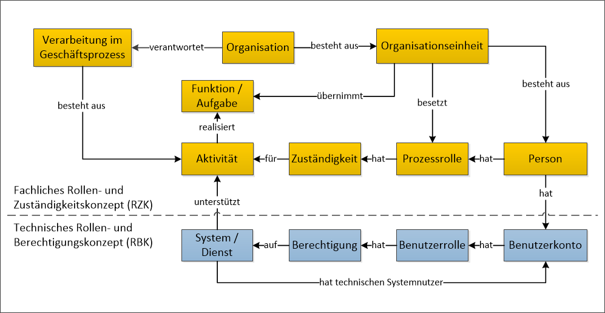
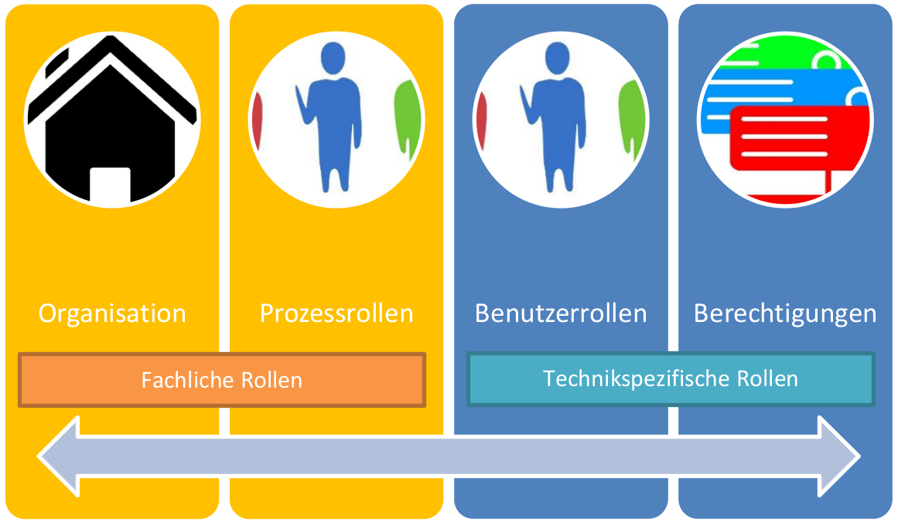

# Baustein 51 „Zugriffe auf Daten, Systeme und Prozesse regeln“ 

> Version: V1.0 

Bezugsquelle: https://www.datenschutz-mv.de/datenschutz/datenschutzmodell/ 

## Versionshistorie 

> SDM-V2.0b_Zugriffe_regeln_V1.0 
>  
> gültig seit: 01.11.2021 
>  
> gültig bis 

## 1. Bezug zu den Anforderungen der DS-GVO und den Gewährleistungszielen

| Anforderungen der DS-GVO                       | Gewährleistungsziele |
|------------------------------------------------|----------------------|
| Integrität (Art. 5 Abs. 1 lit f. DS-GVO)       | Integrität           |
| Verfügbarkeit (Art. 5 Abs. 1 lit f. DS-GVO)    | Verfügbarkeit        |
| Zweckbindung (Art. 5 Abs. 1 lit. b DS-GVO)     | Nichtverkettung      |
| Vertraulichkeit (Art. 5 Abs. 1 lit. f DS-GVO)  | Vertraulichkeit      |
| Datenminimierung (Art. 5 Abs. 1 lit. c DS-GVO) | Datenminimierung     |

## 2. Beschreibung 

### 2.1 Gesamtkonzept zur Abbildung von Zuständigkeit und Berechtigung

Durch die Vergabe von Rollen und die damit einhergehende Erteilung von fachlichen Zuständigkeiten sowie technischen Berechtigungen soll das Risiko einer unrechtmäßigen Datenverarbeitung durch Zugriffe, die unbefugt bzw. nicht vom Zweck der Datenverarbeitung gedeckt sind, unterbunden werden. 

Zentraler Begriff der DS-GVO ist die jeweils auf einem bestimmten Zweck und auf einer bestimmten Rechtsgrundlage basierende „Verarbeitungstätigkeit“ (Art. 30 DS-GVO). Die DS- GVO legt in Art. 4 Nr. 2 DS-GVO dabei fest, was unter „Verarbeitung“ zu verstehen ist. Dem entsprechend kann eine Verarbeitung aus miteinander verbundenen Verarbeitungsschritten (strukturelle Sicht) bzw. aus Aufgaben und Erwartungen an Prozessrollen mit Anweisungen, Geboten und Verboten (funktionale Sicht) bestehen.

Eine Verarbeitungstätigkeit umfasst somit in der Regel verschiedene „Verarbeitungen“ im Sinne des Art. 4 Nr. 2 DS-GVO und ist in die Ablauforganisation einer Stelle integriert. Mit der Methode des Geschäftsprozessmanagements können Verarbeitungstätigkeiten bzw. Geschäftsprozesse lückenlos und mit einer beliebig tiefgehenden Detailierung dargestellt werden. Im Rahmen dieser Methode kann eine Prozesslandkarte eine vollständige Übersicht zu den Geschäftsprozessen bzw. Verarbeitungstätigkeiten geben. Der Zuschnitt und die Modellierung der Geschäftsprozesse müssen gewährleisten, dass Verarbeitungstätigkeiten auf ihren Hauptzweck hin ausgerichtet und zweckgebunden mit den erforderlichen Funktionen und Maßnahmen eingerichtet sind.

Verarbeitungstätigkeiten werden mittels der Aktivitäten eines Geschäftsprozesses durchgeführt. Für die Ausführung dieser Aktivitäten sind grundsätzlich Personen in einer Organisation oder auch organisationsübergreifend arbeitsteilig, entsprechend ihrer jeweiligen Prozessrolle, zuständig. Prozessrollen können von technischen Systemen, die teilweise Aktivitäten auch durch automatisierte Abläufe bearbeiten, unterstützt werden. 

Soweit bewährte Standards im Hinblick auf Geschäftsprozesse oder deren IT-Unterstützung verfügbar sind, sollten diese genutzt werden. Insbesondere SOLLTE der Verantwortliche die Vergabe von Aufgaben und der sich daraus ergebenden Aktivitäten mit Hilfe von standardisierten IT-gestützten Geschäftsprozessen durchführen (M51.P01). Dadurch können Risiken insbesondere in den Bereichen Transparenz und Zweckbindung reduziert werden. 

Um ein Konzept zur Abbildung von Rollen, Zuständigkeiten und Berechtigungen zu erstellen, MUSS der Verantwortliche die Verarbeitungstätigkeiten mit ihren Aktivitäten, den dafür erforderlichen Mitteln, den personenbezogenen Daten und den unterstützend zum Einsatz kommenden Systemen und Diensten analysieren und dokumentieren (M51.P02). Für alle möglichen Datenzugriffe müssen die Gewährleistungsziele mit Blick auf die Rollen bzw. Personengruppen sowie auf die Systeme und Dienste erfüllt werden. Dies bedeutet insbesondere, dass nur solche Zuständigkeiten und Berechtigungen vergeben werden dürfen, welche für die Ausführung der jeweils erforderlichen Verarbeitungsschritte notwendig sind. 

Eine Übersicht über die dafür zu betrachtenden Hauptkomponenten und deren Zusammenhänge gibt die folgende Abbildung. 

> Abbildung 1: Kontext für die Vergabe der Prozess- und Benutzerrollen

### 2.2 Gemeinsamkeiten und Berührungspunkte von Zuständigkeit und Berechtigung

Der Verantwortliche muss Verarbeitungsvorgänge in einem fachlichen Rollen- und Zuständigkeitskonzept für Geschäftsprozesse (RZK) festlegen und diese in einem technischen Rollen- und Berechtigungskonzept für Systeme und Dienste (RBK) abbilden.  

* Im RZK MÜSSEN die Verarbeitungsvorgänge mit ihren Aktivitäten, aus denen sich die Verarbeitungstätigkeit zusammensetzen (M51.P03), die Funktionen und Aufgaben, bspw. geordnet nach Organisationseinheiten (z. B. Abteilungen, Referate) sowie innerhalb dieser (M51.P04), und für die Erledigung von Aufgaben die Prozessrollen mit ihren Zuständigkeiten definiert und dokumentiert werden. Dabei sollte auf übliche, branchentypische Rollenbezeichnungen („Sachbearbeitung“, „Leitung Personalverwaltung“, „Administration Betriebssysteme“ usw.) zurückgegriffen werden (M51.P05).
* Im RBK MÜSSEN die Benutzerrollen mit ihren Berechtigungen und die entsprechende technische Abbildung in den Systemen und Diensten definiert sowie dokumentiert werden (M51.P06).

Viele der oben angesprochenen Details und Festlegungen sollten konsistent in möglichst wenigen Dokumenten dargestellt werden; sie sind aber häufig Inhalt in verschiedenen Unterlagen, wie bspw.
* in Geschäftsverteilungsplänen, 
* in Organigrammen, 
* in Modellierungen und sonstigen Beschreibungen von Geschäftsprozessen (Ablauforganisation), 
* in Verträgen, 
* im Verzeichnis der Verarbeitungstätigkeiten (Art. 30 DS-GVO), 
* in Ausführungsbestimmungen und Betriebsvereinbarungen, 
* in Stellenbeschreibungen und Arbeitsverträgen, 
* in denen die Rechte und Pflichten der Beschäftigten dokumentiert sind, 
* in Betriebskonzepten für Systeme und Dienste, die auch Aktivitäten, die sich speziell auf den technischen Betrieb beziehen, wie etwa die Konfiguration und die dauerhafte Überwachung der technischen Verarbeitung, beinhalten sowie * in IT-Sicherheitskonzepten.

> Abbildung 2: Zusammenhang zwischen fachlichen und technikspezifischen Rollen 

Das Rollen- und Zuständigkeitskonzept sowie das Rollen- und Berechtigungskonzept stehen nicht isoliert nebeneinander, sondern sind stark miteinander verknüpft. Das Rollen- und Berechtigungskonzept verbindet in einer Organisation die Ebene der Verarbeitung („Fachlichkeit“) mit der Ebene der Ausführung von zugehörigen technischen Funktionen, die mit Hilfe von Systemen und Diensten realisiert werden. Bei dieser Verbindung hat der Verantwortliche zu gewährleisten, dass alle fachlichen Anforderungen an die Verarbeitungstätigkeit vollständig in die technische Ebene transformiert werden. Der Verantwortliche MUSS aus struktureller und funktionaler Sicht spezifizieren, wie die jeweiligen Verarbeitungstätigkeiten und die davon umfassten Aktivitäten mit der Unterstützung von eingesetzten Systemen und Diensten realisiert werden (M51.P07). Entsprechend sollte der Verantwortliche zur Realisierung der jeweiligen Verarbeitungen korrespondierende verarbeitungsspezifische Benutzerrollen ableiten, die zudem eine Zweckbindung der Verarbeitung in Bezug auf den jeweiligen Geschäftsprozess gewährleisten. Der Verantwortliche SOLLTE die Verknüpfung zwischen fachlichen und technikspezifischen Rollen durch eine möglichst passende Abbildung in Systemen und Diensten modellieren, um sicherzustellen und nachweisen zu können, dass das Rollen- und Berechtigungskonzept das fachliche Rollen- und Zuständigkeitskonzept umsetzt (M51.S01). 

Identifizierte Prozessrollen mit ihren Aufgaben, Zuständigkeiten und Aktivitäten werden mit Benutzerrollen mit ihren technischen Funktionen und Berechtigungen der unterstützenden Systeme und Dienste in Beziehung gesetzt. Differenzen bei der Umsetzung dieser Aufgabe, die sich z. B. aus dem konkreten Einsatz verfügbarer Systeme und Dienste ergeben, MÜSSEN vom Verantwortlichen begründet, rechtlich beurteilt und dokumentiert werden (M51.P08).

Der Verantwortliche SOLLTE die Vorgänge einer Verarbeitung und die daraus abgeleiteten Aufgaben und Prozessrollen bereits in der Planungsphase dokumentieren, damit die notwendigen Berechtigungen auf der Ebene der Systeme und Dienste sowie die zu realisierenden Implementierungen im Sinne des Datenschutzes durch Technikgestaltung rechtzeitig sichtbar werden (M51.P09). 

Prozess- sowie Benutzerrollen zu vergeben und Zuständigkeiten sowie Berechtigungen zu erteilen bedeutet, dass Zuständige innerhalb der Organisation festlegen MÜSSEN, welche Verarbeitungen durch welche Person ausgeführt werden (M51.P10). 

Wenn Verarbeitungstätigkeiten voneinander logisch bzw. funktional getrennt sind, sollte eine Zweckbindung jeder beabsichtigten Verarbeitungstätigkeit und der dafür eingesetzten Daten, Systeme und Dienste sowie Prozesse insbesondere durch Trennungsmaßnahmen durchgesetzt werden (siehe Baustein 50: „Trennen“). Dabei ist zu beachten, dass Verarbeitungen mit unterschiedlichen Zwecken und Aufgaben schon auf der fachlichen Ebene mit unterschiedlichen Aktivitäten und Zuständigkeiten umgesetzt werden SOLLTEN, deren Trennung bis hinunter auf die Ebene der Berechtigungen auf Daten in Systemen und Diensten erfolgt (M51.S02). 

In den Phasen der Planung, Spezifizierung und Implementierung (siehe SDM, Abschnitt D4.4 Datenschutzmanagement-Prozess) MUSS deshalb geklärt und dokumentiert werden, 
* welche personenbezogenen Daten in welchem Verarbeitungsvorgang verarbeitet werden (M51.D01), 
* welche personenbezogenen Daten zu welchen Zeitpunkten verarbeitet werden dürfen (geltende gesetzliche Fristen bspw. für Einschränken und Aufbewahren) (M51.D02), 
* welche personenbezogenen Daten erforderlich sind, damit sich einerseits Benutzer  authentisieren und damit andererseits der Verantwortliche die Benutzer entsprechend der Rolle authentifizieren und autorisieren kann (M51.D03) und
* welche personenbezogenen Daten in welchen Speicherorten bzw. in welchen jeweiligen Systemen und Diensten verarbeitet werden (M51.D04).

Obwohl die Zuständigkeit wie auch die Berechtigung nur die folgenden, relativ wenigen Elementarausprägungen aufweisen, können sich daraus im Einzelfall äußerst komplexe Zuständigkeits- und Berechtigungsprofile für eine Prozess- bzw. Benutzerrolle ergeben. Die Zugriffsmöglichkeit einer Prozessrolle richtet sich nach den ihr zugeordneten Zuständigkeiten. Bei den Zuständigkeiten, also bei den Zugriffsmöglichkeiten von Personen auf die Aktivitäten eines Geschäftsprozesses, können nach der sogenannten RASCI-Methode folgende elementare fachliche Zuständigkeiten festgelegt werden (vgl. DGFP 2009):
* Durchführungsverantwortung (Responsible): Person ist zuständig für die eigentliche Durchführung der Aktivität.
* Gesamtverantwortung (Accountable): Person ist verantwortlich im Sinne von „genehmigen“, „freigeben“ oder „unterschreiben“.
* Unterstützung (Support): Person hat eine unterstützende Rolle oder stellt Verarbeitungsmittel zur Verfügung.
* Konsultation (Consulted): Person hat relevante Informationen für die Umsetzung der Aktivität und soll/muss deshalb befragt werden.
* Informationsrecht (Informed): Person, die Informationen über den Verlauf bzw. das Ergebnis der Aktivität erhält oder die Berechtigung besitzt, Auskunft zu erhalten. 

Falls eine Aktivität durch ein System oder Dienst unterstützt wird, sind die erforderlichen Benutzerrollen (Technik) mit den Prozessrollen (Organisation) direkt verbunden. Benutzerrollen können folgende elementare technische Berechtigungen besitzen:
* das Erstellen bzw. die Neuanlage, 
* das Lesen, 
* das Schreiben und das Ändern sowie
* das Löschen von personenbezogenen Daten.

Mittels einzelner oder kombinierter technischer Elementarberechtigung können insbesondere folgende umfassendere technische Funktionen von einem entsprechend berechtigten Benutzer eines Systems oder Dienstes durchgeführt werden:
* Erfassung, Import und Aufbereitung von Daten, 
* Löschen von Daten in Dateien, Verzeichnissen oder Datenbanken (siehe Baustein „Löschen und Vernichten“), 
* Kopieren von Verzeichnissen und Dateien, die Daten enthalten, 
* Daten-Transport bei einem Export oder einer (automatisierten) Übertragung bzw. Übermittlung und
* Aufruf von Datenabfragen und -berichten.

Die elementaren technischen Berechtigungen können mit verschiedenen Komponenten verbunden sein, wie etwa mit:
* Speichermedien (HD, Cloud, NAS…), 
* Verzeichnissen, 
* Dateien, 
* Tabellen bzw. Datensätzen in Datenbanken und
* einzelnen Daten in Dateien (z. B. in Log-Dateien). 

Die elementaren Zuständigkeiten und elementaren Berechtigungen ermöglichen folgende Funktionen auf personenbezogenen Daten bzw. Dateien, die eine besondere Rolle spielen:
* das Erheben, Erfassen, Organisieren, Ordnen, Anpassen, Verändern) und Speichern (Art. 4 Nr. 2 DS-GVO), 
* das Berichtigen (Art. 16 DS-GVO / siehe Baustein „Berichtigen“), 
* das Auslesen und Abfragen, die Verwendung (Art. 4 Nr. 2 DS-GVO Nr. 2), 
* das Löschen oder die Vernichtung (Art. 4. Nr. 2 DS-GVO), im Sinne des „Rechts auf Vergessenwerden“ (Art. 17 DS-GVO / siehe Baustein „Löschen und Vernichten“), 
* das Einschränken der Verarbeitung von Daten (Art. 18 DS-GVO / siehe Baustein „Einschränken der Verarbeitung“) und
* die Offenlegung durch Übermittlung und Verbreitung (Art. 4 DSGVO Nr. 2) bzw. das Übertragen von Daten (Art. 20 DS-GVO). 

Die fachlichen Zuständigkeiten und technischen Berechtigungen sind zur Realisierung der jeweiligen Aktivitäten zu spezifizieren. 

Für die Zuweisung von Zuständigkeiten und Berechtigungen SOLLTE der Verantwortliche einen Ablauf festlegen, in dem geregelt wird, welche
* Organisationseinheiten (z. B. Abteilungen, Referate) welche Prozessrollen besetzen, 
* welche Prozessrollen mit welchen Aktivitäten verbunden sind, 
* welche Prozessrollen mit welchen Personen besetzt werden, 
* welche Prozessrollen mit welchen Benutzerrollen verknüpft sind, 
* welche maximalen Zeiträume für die Aktualisierung von Berechtigungszuordnungen bestehen und
* welche Techniken des Identitätsmanagements und die dafür genutzten Systeme (z. B. Verzeichnisdienste wie LDAP/Active-Directory, X509, Systembenutzerverwaltung, Datenbank- und Dateisystem-Benutzerverwaltung) genutzt werden (M51.P11). 

Der Verantwortliche muss nachvollziehbare Abläufe einrichten, mit denen einer Person Prozessrollen und damit auch über Benutzerkonten die Benutzerrollen zugeordnet werden. Eine Rolle kann von mehreren Personen eingenommen werden; eine Person kann mehrere Rollen wahrnehmen. Der Verantwortliche MUSS eine für die Organisation zuständige Rolle bestimmen, die durch Rollenzuordnungen den Personen die Zugriffe auf eine Verarbeitungstätigkeit mit ihren Systemen, Diensten sowie den dazugehörigen Datenbeständen gewährt (M51.P12). 

Zeitlich befristete Einschränkungen oder Erweiterungen von Zuständigkeiten und Berechtigungen sind durch eine Rollenanpassung, die auch aus einem Rollenentzug bestehen kann, umzusetzen. Zu beachten ist insbesondere, dass rechtzeitig Vertretungsregelungen sowohl für den Fall von Krankheitsfällen als auch bei sonstigen langanhaltenden Abwesenheiten mit der entsprechenden Übertragung von Prozess- und Benutzerrollen („Delegation“) festzulegen sind. Der Verantwortliche bzw. die für die Organisationsstrukturierung zuständigen Personen müssen darauf achten, dass Rollenkonflikte vermieden bzw. ausgeschlossen werden. Es handelt sich insbesondere dann um einen Rollenkonflikt, wenn gegen eine Rollenkontrollhierarchie, eine normativ vorgegebene Funktionstrennung oder gegen das Gebot eines vom Verfahrenszweck gebundenen, erforderlichen Zugriffs verstoßen wird. Deshalb SOLL der Verantwortliche vermeiden, Vertretungen aus solchen Bereichen einer Organisation zu benennen, die Daten für andere Zwecke verarbeitet (M51.P13). Zudem MUSS bei Vertretungen auch gewährleistet sein, dass der Vertreter nur die Rechte bekommt, die für die Bearbeitung der temporär übertragenen Aufgaben notwendig sind. Gegebenenfalls ist hierfür eine eigene Rolle einzurichten (M51.P14). 

Der Verantwortliche MUSS die wirksame Umsetzung des Rollen- und Zuständigkeitskonzepts für Geschäftsprozesse und des Rollen- und Berechtigungskonzepts für Systeme und Dienste durch technische und organisatorische Maßnahmen absichern (M51.S03). 

Der Verantwortliche SOLLTE eine regelmäßige Revision des Rollen- und Zuständigkeitskonzepts sowie des Rollen- und Berechtigungskonzepts durchführen, um ggf. notwendige Änderungen erkennen und umsetzen zu können, die sich z. B. aus veränderten Organisationsstrukturen, Techniken oder auch bei Gesetzesanpassungen ergeben können (M51.P15). Zudem sind Anpassungen von Zuständigkeiten und Berechtigungen erforderlich, 
* wenn Zuständigkeiten sowie Delegationen anders strukturiert werden, 
* wenn sich eine Prozessrolle verändert oder
* wenn eine Person die Organisationseinheit wechselt oder aus der Organisation ganz ausscheidet.

Wenn Zuständigkeiten einer Person entfallen, MUSS der Verantwortliche die Zuordnung der Person zu den Prozessrollen anpassen und damit auch die Berechtigungen für Systeme und Dienste synchronisieren (M51.P16).

Wenn die Verarbeitungstätigkeit verändert oder eingestellt wird, MUSS der Verantwortliche die vergebenen Prozess- und Benutzerrollen prüfen und ggf. den damit verbundenen Personen entziehen (M51.P17). 

### 2.3 Fachliches Rollen- und Zuständigkeitskonzept (RZK)

Durch die Analyse der Aufgaben und organisatorischen Verantwortung SOLLTE der Verantwortliche die fachlichen Prozessrollen identifizieren und festlegen, um Verantwortlichkeiten, Zuständigkeiten sowie Delegationen zu klären. Parallel dazu sind die Aktivitäten zu spezifizieren, die die Umsetzung von Geschäftsprozessen sicherstellen (M51.P18). 

Jeder Funktion und Aufgabe, die sich aus der Organisationsstruktur ergibt, SOLLTE der Verantwortliche eine Prozessrolle zuordnen (M51.P19). Sowohl intern Beschäftigte als auch Beschäftigte von externen Dienstleistern haben zahlreiche Aufgaben bzw. nehmen Funktionen wahr, die spezielle Zuständigkeiten bei der Verarbeitung von Daten erfordern; dies betrifft auch administrative Funktionen und Rollen mit Querschnittsaufgaben. Als Beispiele können folgende typische Prozessrollen genannt werden:
* Abteilungs- und Referatsleitung; 
* Sachbearbeitung; 
* Projektmanagement; 
* externe Beratung für Organisation und Technik; 
* Auditoren mit Kontrollaufgaben (z. B. interne Revision, Aufsichtsbehörde, Wirtschaftsprüfer); 
* IT-Architektur, die unmittelbar mit den Inhalten und der Logik der Verarbeitung befasst ist; 
* Administration, arbeitsteilig (z. B. Fachapplikation, Datenbanken, Backup-Management, Netzwerk); 
* Rollen mit besonderen Querschnittsaufgaben, wie z. B.:
    - Datenschutzbeauftragte (und zunehmend spezialisierte Rollen im Kontext des administrativen Datenschutzes oder des Datenschutzmanagements, z. B. Datenschutz-Team), IT-Sicherheitsbeauftragte (zunehmende Spezialisierungen) und Notfall- Management und
    - Revision und Qualitätsmanagement.
* externe Dienstleister (mit eigenen Leitungen) für funktionale Aufgaben, z. B.
    - Aktenvernichtung,
    - Hersteller von Hardware und Software und
    - Wartungsdienstleister.
* Falls vorgesehen, Zugänge für Betroffene mit entsprechenden Berechtigungen bspw. für die Pflege der eigenen Stammdaten. 

Wenn Verarbeitungen von Auftragsverarbeitern in die Organisation integriert sind, MÜSSEN hierfür die Erwartungen des Verantwortlichen zu Anforderungen an Prozessrollen formuliert und entsprechend transformiert werden sowie Aufgaben und Aktivitäten definiert werden. Dies ist wesentlich, wenn Auftragsverarbeiter für Aufgaben und Übernahme von Aktivitäten zuständig sind, die aus dem Betrieb spezieller Systeme und Dienste resultieren (M51.P20). 

Der Verantwortliche MUSS jeder Prozessrolle Personen zuordnen (M51.P21). Dabei kann es sich auch um temporäre Rollenzuweisungen handeln, die geplant durch einen Vertretungsfall oder unvorhergesehen etwa durch einen Notfall initiiert werden. Risikoorientiert MUSS der Verantwortliche die Rollen für derartige temporäre Zuweisungen vorab erstellt haben. Um beispielsweise das Störungs- und Notfall-Management auch für den Fall funktionsfähig zu halten, dass die jeweiligen Systemverantwortlichen, Systembetreibenden oder Systemadministratoren des Normalbetriebs nicht verfügbar sind, sind Vertreter zu bestimmen, bevor eine Störung oder gar ein Notfall eintreten können.

Durch temporäre Rollenzuweisungen werden für einen begrenzten Zeitraum gültige Rollenzuweisungen außer Kraft gesetzt (M51.P22). 

Organisationsinterne Vorgaben (z. B. Richtlinien und Vorgehensweisen) SOLLTEN auch relevante organisationsexterne Anforderungen aufnehmen und diese in eine auf die konkrete Organisation angepasste Form übersetzen, damit der Verantwortliche die ihm obliegenden Rechenschafts- und Nachweispflichten erfüllen kann (M51.P23). Der Verantwortliche MUSS sicherstellen, dass Änderungen gesetzlicher Regelungen und/oder des Stands der Technik rechtzeitig auf ihre Relevanz geprüft werden und relevante Änderungen unverzüglich zur Anpassung der Vorgaben und zur Umsetzung führen (M51.P24). 

Um sicherzustellen, dass Beschäftigte personenbezogene Daten nur auf Anweisung des Verantwortlichen verarbeiten, MUSS er diese entsprechend unterweisen (M51.P25). Zur Steigerung der Sensibilität SOLLTE der Verantwortliche seine Beschäftigten bedarfsgerecht unterrichten bzw. schulen (M51.P26). Er SOLLTE zudem durch das Einholen entsprechender Bestätigungen bzw. durch die Dokumentation der jeweiligen organisatorischen Rahmenbedingungen nachweisen können, dass er die Beschäftigten über die Vorgaben, deren Geltungsbereich und Geltungsdauer sowie mögliche Anpassungen informiert hat (M51.P27). 

Der Verantwortliche muss angemessen auf die Änderung der Arbeitsorganisation reagieren. Ein Beispiel für solche Änderungen ist die Neueinführung von Mobilen Arbeiten und Telearbeitsplätzen sowie die Verwendung von mobilen Endgeräten. 

Wenn betroffenen Personen selbst Zugriff auf ihre personenbezogenen Daten gewährt wird, bspw. in Form von „Bürger- oder Kundenkonten“, sollten die Zugriffe funktional vollständig anhand der Anforderungen aus den Betroffenenrechten von Art. 12 bis 22 DS-GVO („Kapitel III“) ausgestaltet werden. 

Über jegliche Änderungen im Betriebsablauf SOLLTE der Verantwortliche die betroffenen Beteiligten und Beschäftigten informieren (M51.P28). Dabei MUSS er die Anforderungen des Beschäftigten-Datenschutzes berücksichtigen (vgl. DSK 2018: Kurzpapier Nr. 14 „Beschäftigtendatenschutz“) (M51.P29).

### 2.4 Technische Umsetzung des Rollen- und Berechtigungskonzept (RBK)

Es muss die Ebene der fachlichen Aufgaben bzw. der dazugehörigen Aktivitäten mit den elementaren technischen Funktionen auf der Ebene der Systeme und Dienste verbunden werden. Dieser notwendig herzustellende Zusammenhang MUSS dokumentiert werden, was in Form eines „Rollen- und Berechtigungskonzepts“ zusammengefasst werden sollte, um diese Informationen zusammenhängend an einer zentralen Stelle zu finden (M51.S04). 

Als wesentliche Gestaltungsmechanismen eines Rollen- und Berechtigungskonzepts innerhalb einer Organisation MUSS der Verantwortliche sichere Authentifizierungen und Autorisierungen realisieren (M51.S05). Der Vorgang des Authentifizierens weist denjenigen Personen ein Benutzerkonto mit Benutzerrollen zu, die zuvor vom Verantwortlichen zur Einnahme dieser Rollen befugt wurden. In Systemen und Diensten folgt einer erfolgreichen Authentifizierung eine personen- bzw. rollenspezifische Autorisierung für Zugriffe auf Systeme, Dienste und Daten. War hingegen eine Authentifizierung nicht erfolgreich, erfolgt keine Autorisierung und der Zugriff wird verweigert. Die Schutzmaßnahmen der Authentifizierung und Autorisierung sind nicht Gegenstand dieses Bausteins. 

Durch die wirksame Umsetzung eines Rollen- und Berechtigungskonzepts sollen nach einer erfolgreichen Autorisierung personenbezogene Daten einer Verarbeitungstätigkeit nur nach einem festen Regelwerk durch Systeme und Dienste nachvollziehbar sowie steuerbar genutzt werden können. Der Verantwortliche MUSS die Benutzer von Systemen und Diensten über die jeweils gültigen Vorgaben informieren (M51.P30). 

Zur Bearbeitung einer Aktivität benötigen Personen in Abhängigkeit ihrer Prozessrolle entsprechende Ressourcen. Sowohl die Umsetzung von rollenspezifischen Zuständigkeiten als auch die Zuteilung von Verarbeitungsmittel (bspw. Datenbstände und Speicherstellen, Programme) bedeuten, dass rollenspezifisch entsprechende Berechtigungen für Systeme und Dienste infrastrukturweit zu erteilen sind, wie der Zugang zu und der Zugriff auf sich im betrieblichen Einsatz befindliche Systeme und Dienste. 

Der Verantwortliche MUSS im Rollen- und Berechtigungskonzept die Berechtigungen der einzelnen Benutzerrolle, die Protokollierungsart der Aktionen der Benutzer und das Verfahren ausweisen, mit dem Benutzer und Benutzerrollen verwaltet und Berechtigungen für den Zugriff auf Daten, Systeme und Dienste vergeben bzw. entzogen werden (M51.P31). Dabei MUSS auch eine Auftragsverarbeitung berücksichtigt werden (M51.P32). 

Damit Systeme und Dienste funktionstüchtig und datenschutzkonform betrieben werden, MUSS der Verantwortliche die korrekte Umsetzung der Benutzerrollen und deren Berechtigungen in Systemen und Diensten mit Zugriff auf die Daten testen und freigeben (M51.D05). 

Der Verantwortliche MUSS das Rollen- und Berechtigungskonzept bereits in den Phasen der Planung und Spezifizierung testen (Baustein „Planen und Spezifizieren“; M51.P33). Dafür nehmen oftmals Projektmitglieder Rollen ein, die den zukünftigen Aufgaben und Abläufen entsprechen sollen. Beim Übergang von der Projektphase in die Betriebsphase MUSS der Verantwortliche die Konfigurationen aus Entwicklungs- und/oder Test-Umgebungen umstellen und das RBK ausschließlich für den Betrieb der Systeme und Dienste auslegen. Bereits in der Pilotierungsphase MUSS das spätere RBK überprüft und abgenommen werden (M51.P34). 

Bei der oft anzutreffenden hohen Komplexität von Berechtigungssystemen MUSS der Verantwortliche bei der Zuordnung von Benutzerrollen zu einem Benutzerkonto gewährleisten, dass insbesondere die Kombination unterschiedlicher Benutzerrollen nicht zu einer unzulässigen Gesamtberechtigung einer Person oder eines technischen Systemnutzers führt (M51.P35). 

Für Querschnittsaufgaben SOLLTE der Verantwortliche ein eigenes Kapitel im Berechtigungskonzept vorsehen, wenn abweichend vom üblichen Berechtigungskonzept abteilungsgrenzen- oder prozess-, system- und dienst-übergreifend auf Daten zugegriffen wird (M51.P36). Solche Zugriffe müssen unter Bedingungen gestellt werden. Hierfür SOLLTE der Verantwortliche, wenn Anforderungen der wechselseitigen Kontrolle unterschiedlicher Rollenträger durchgesetzt werden müssen, mittels Berechtigungen das Vier-Augen-Prinzip implementieren, indem z. B. zwei Personen nacheinander ihre Zugangsdaten erfolgreich bei einer Authentifizierung eingeben oder zeitgleich auf einem System eingeloggt sein müssen, um auf bestimmte Daten gemeinsam zugreifen zu können (M51.P37). Derartige Aktionen MÜSSEN zudem protokolliert und auf die Berechtigung des Zugriffs hin geprüft werden. 

Bei Projekten und Entwicklungen von Verarbeitungstätigkeiten, die außerhalb einer durchgängig hierarchisch gegliederten Organisation (Linienorganisation) liegen, MUSS der Verantwortliche ggf.
* Berechtigungen aus der Entwicklungsabteilung in den laufenden Betrieb in geplanter Art und Weise überführen und
* Berechtigungen für Personen aus der Entwicklungsabteilung entziehen (M51.P38, M51.S06). 

Um Funktionen auf der technischen Ebene festzulegen und alle Datenflüsse, die personenbezogene Daten umfassen, darzustellen, muss der Verantwortliche zudem Netzpläne („Topologie“) und eine Dokumentation der Datenflüsse (z. B. in Form eines „Datenflussdiagramms“) vorhalten. In den Netzplänen MÜSSEN die Verbindungen zwischen allen beteiligten Systemen (organisationsexternen und -internen) dokumentiert sein (M51.S07). Die Datenflüsse MÜSSEN mit weiteren Angaben zu Schnittstellen einschließlich Angaben zu genutzten Protokollen, Flussrichtungen und Maßnahmen zu Absicherungen - bspw. durch Verschlüsselungsstandards - dokumentiert sein (M51.S08). Technische nicht personengebundene Systemnutzer, welche für die Kommunikation benötigt werden, können in diesen Netzplänen verzeichnet werden. 

Bei einer Datenübermittlung gemäß Art. 20 DS-GVO („Recht auf Datenübertragbarkeit“) ist nicht auszuschließen, dass die Daten einer betroffenen Person, die unter Umständen in verschiedenen Bereichen einer Organisation verarbeitet wurden, an einer Stelle zusammengeführt werden, um sie der betroffenen Person oder einer anderen Organisation zu übergeben. Neben dieser speziellen Verarbeitung für die Datenübertragbarkeit können auch insbesondere bei einem Export von Daten oder nach dem Ausdruck von Daten die eingerichteten Rollen mit ihren Zugriffsmöglichkeiten auf die Daten umgangen und damit die Daten rechtswidrig verarbeitet werden. Um dieses Risiko zu minimieren, MÜSSEN entsprechende Schutzmaßnahmen wirksam umgesetzt werden, wie etwa die grundsätzliche Deaktivierung technischer Exportfunktionen und die Sensibilisierung der beteiligten Beschäftigten (M51.P39). 

Technische Systemnutzer und Standard-Benutzer im Auslieferungszustand von Systemen und Diensten sowie deren Berechtigungen MÜSSEN dem Verantwortlichen bekannt und deren Benutzerkonten ausreichend abgesichert sein (z. B. durch zweckgebunden eingeschränkte Berechtigungen im Sinne des „need to know“-Prinzips, geeignete Passworte oder Deaktivierungen, sofern sie nicht benötigt werden) (M51.P40). Technische Systemnutzer eines Systems oder Dienstes werden insbesondere dafür genutzt, automatisierte Abläufe durchzuführen (z. B. Erstellung einer Datensicherung, automatisierte Übermittlung von Daten).

Da zur Aufgabenerfüllung von Fach- und Systemadministratoren häufig weitreichende Zugriffsberechtigungen erforderlich sind, SOLLTE der Verantwortliche administrative Aufgaben im Rollen- und Berechtigungskonzept in besonderer Weise darlegen (M51.P41). Es SOLLTE beschrieben werden, welche zur Administration und Nutzung der Verarbeitungstätigkeit gehörenden Zugänge verfügbar sind und wie diese vor Zugriff Unbefugter abgesichert sind. Administrative Funktionen MÜSSEN durch Benutzerrollen von anderen nicht-administrativen Benutzerrollen getrennt werden (M51.P42). Dies ist von besonderer Bedeutung, wenn Externe bei administrativen Aktivitäten beteiligt sind, z. B. im Support. So muss der Verantwortliche Zugänge oder auch Zugriffe durch alle Ebenen der Systeme und Dienste voneinander trennen. Zudem MUSS er Zugriffe entsprechend protokollieren (M51.S09, siehe Baustein „Protokollieren“). Das ist wichtig, wenn in Systemen und Diensten weitreichende Änderungen vorgenommen werden, zu denen Eingriffe in die System- oder Dienstarchitektur sowie in die Datenhaltung gehören. 

Sollten Aktivitäten von im Hintergrund laufenden automatisierten technischen Abläufen unterstützt werden, sind diese zu identifizieren und in ihrer Reichweite in Bezug auf ihre Systemgrenzen zu analysieren. Der Verantwortliche MUSS diesen automatisierten Abläufen unter Berücksichtigung der jeweiligen Konfigurationen von Systemen und Diensten die erforderlichen Benutzerrollen zuweisen. Die gesamte Implementierung dieser Abläufe MUSS hinsichtlich der organisatorischen Verantwortlichkeit erfolgen (M51.P43). Aufgrund der eingeschränkten Sichtbarkeit MUSS besonders abgesichert werden, dass insbesondere die notwendige Berücksichtigung bei Verarbeitungsänderungen gegeben ist (M51.P44). 

Vergebene Berechtigungen MUSS der Verantwortliche anlassbezogen und regelmäßig evaluieren, dokumentieren und sicherstellen, dass Personen und technische Systemnutzer mit ihren Benutzerrollen korrekt verknüpft sind (M51.P45, M51.S10). 

Je nach Komplexität der IT-Infrastruktur und in Abhängigkeit des aus der Verarbeitung resultierenden Risikos für die betroffenen Personen sollte der Verantwortliche folgende Konzepte umsetzen:
* Identitätsmanagement für heterogene IT-Infrastrukturen, in denen verschiedene Systeme mit unterschiedlicher Netzanbindung betrieben werden, die dennoch aus Nutzungssicht als genau ein System erscheinen sollen („Single-Sign-On“, SSO) (M51.S11); 
* Systemspezifisches Login für den kontrollierten Zugang und oftmals sehr 
eingeschränkten Zugriff auf ein System und/oder einen Rechner für einen sehr speziellen Zweck (z. B. Ausdruck von Urkunden); ein solches System oder ein solcher Rechner besitzt dann zumeist keinen Netzzugang (M51.S12).
* Der Verantwortliche MUSS revisionssicher nachweisen können, zu welchem Zeitpunkt einem Benutzer welche Rollen zugewiesen oder entzogen wurden (M51.S13).
* Technische Systemnutzer, welche etwa für Wartungszwecke oder die 
Kommunikation zwischen Systemen benötigt werden, MÜSSEN als solche erkennbar und dem jeweiligen Zweck entsprechend spezifisch berechtigt sein und protokolliert werden (M51.S14).
* Werden direkte Zugänge für Betroffene zur eingesetzten IT-Infrastruktur ermöglicht (z. B. Kundenportale), MÜSSEN erforderliche Prozesse und Systeme für die Registrierung neuer Nutzerzugänge etabliert werden (M51.S15). Beispielsweise können Verantwortliche mittels eines Portals die kundeneigene Erzeugung und Verwaltung von Benutzerkonten ermöglichen. Es kann demnach erforderlich sein, dass Systeme und Dienste mehrere Benutzertypen für Beschäftigte und externe Benutzer unterstützen.

Weitere wesentliche Aspekte werden unter „Identitäts- und Berechtigungsmanagement“ im IT-Grundschutz unter dem Stichwort „ORP: Organisation und Personal“ angesprochen, die bei der Gestaltung der Systeme unbedingt mit beachtet werden sollten (siehe BSI 2021).

## 3. Differenzierung bei hohem Schutzbedarf 

Verarbeitungsvorgänge, die mit einem hohen Risiko hinsichtlich der Rechte und Freiheiten natürlicher Personen behaftet sind, müssen identifiziert werden. Die risikomindernden Schutzmaßnahmen mit Bezug zu Zuständigkeiten und Berechtigungen MÜSSEN bei hohen Risiken im Rahmen einer Datenschutz-Folgenabschätzung (DSFA) identifiziert und bearbeitet werden (M51.P46). Die Berechtigungsvergabe bedarf immer einer besonders sorgfältigen Modellierung, Realisierung und einer turnusgemäßen Überprüfung im Rollen- und Berechtigungskonzept. Solche Rollen und deren Zuordnungen zu Personen MUSS der Verantwortliche in besonderer Weise festlegen, dokumentieren und überprüfen (M51.P47). Der Verantwortliche MUSS Personen, die eine solche Rolle innehaben, darüber gesondert informieren. Der Verantwortliche MUSS prüfen, welche der beteiligten Personen zur Verschwiegenheit verpflichtet werden müssen (M51.P48). Aus der Sicht des Verantwortlichen SOLLTEN Personen risikoorientiert in Abhängigkeit der organisationsspezifischen Aktivität einer zusätzlichen Sicherheitsprüfung unterzogen werden (M51.P49). 

Nach Beendigung der im Zeitfenster erforderlichen verarbeitungsspezifischen Aktivitäten SOLLTE der Verantwortliche die Rollen unverzüglich, vorzugsweise automatisiert, wieder entziehen. Neben einer Steuerung durch ein festgelegtes Zeitfenster ist auch eine Ereignis- gesteuerte Vergabe von Rollen bzw. deren Entzug möglich („event-driven architectures“) (M51.S16). Der Verantwortliche MUSS jede temporäre, insbesondere kurzzeitige Befugnis zur Ausführung einer verarbeitungsspezifischen Aktivität protokollieren (M51.S17, siehe auch Baustein „Protokollieren“). 

Neben der bereits geforderten Trennung von Aufgaben und entsprechender verarbeitungsspezifischer Aktivitäten für intern Beschäftigte und Externe MUSS der Verantwortliche entscheiden und dokumentieren, inwiefern Externe Verarbeitungen mit hohem Risiko ausführen dürfen (M51.P50). 
Führt eine Verarbeitungstätigkeit zu einem hohen Risiko für die betroffenen Personen, müssen der Zuschnitt von Rollen und das Management von Zuständigkeiten und Berechtigungen erhöhten Anforderungen genügen. Konkret bedeutet das, dass standardisierte Vorkehrungen für folgende Aspekte getroffen werden:
* Die den Prozessrollen zugewiesenen Aktivitäten SOLLTEN sehr eng und unmissverständlich klar im Rollen- und Zuständigkeitskonzept definiert sein. Die dadurch möglichen Aktivitäten SOLLTEN nur weitgehend standardisiert durchführbar sein (M51.P51).
* Eine Funktionstrennung MUSS sowohl bei der Zuordnung der Berechtigungen zu einer Benutzerrolle als auch bei der Zuordnung einer Person bzw. eines Benutzerkontos zu den Benutzerrollen gewährleistet werden (M51.P52). Typischerweise wird diese Funktionstrennung umgesetzt, indem der Fachbereich die Berechtigungsanforderungen an eine Benutzerrolle und die Personen, die bestimmte Benutzerrollen haben sollen, vorgibt und der IT-Bereich einer Organisation diese Vorgaben dann umsetzt. Auch dieser Ablauf ist im Vorfeld und nicht „auf Zuruf“ festzulegen.
* Die Vorgaben für Aktivitäten der Beschäftigten und den Betrieb von Systemen und Diensten SOLLTEN für alle damit befassten Beschäftigten leicht, d. h. jederzeit zugänglich sein (M51.P53).
* Das Rollen- und Berechtigungskonzept und die Vorgaben MÜSSEN vor unbefugter Kenntnisnahme geschützt sein (M51.P54).
* Vertretungsregeln MÜSSEN vollständig formuliert sowie aktuell sein und SOLLTEN bis in die zweite Reihe, eine generelle Regel auch zur Vertretung von Vertretungen, reichen (M51.P55).
* Die Erteilung spezieller Befugnisse in den Situationen, in denen Hierarchien des Normalbetriebs zeitweise aufgehoben werden, SOLLTEN im Vorhinein definiert und geregelt sein und MÜSSEN während der Phase ihrer Inanspruchnahme protokolliert werden (M51.P56).
* Die anlassbezogene und kontinuierliche Fortschreibung des Rollen- und Berechtigungskonzepts und der Vorgaben durch Beschäftigte, die für die Fortschreibung ausdrücklich befugt sind, MUSS sichergestellt werden (M51.P57).
* Änderungen im Rollen- und Berechtigungskonzept MÜSSEN revisionsfest 
dokumentiert und protokolliert werden (M51.P58).
* Änderungen von Organisations- und Arbeitsstrukturen, die zu Änderungen von Rollendefinitionen und Zugriffsrechten - wie die Erteilung, die Änderungen bei einzelnen Rechten oder deren Entzug - führen, MÜSSEN revisionsfest dokumentiert und protokolliert werden (M51.P59).
* Bei Auftragsverarbeitung in Form der Nutzung eines Rechenzentrums bzw. von Clouddiensten MUSS dem Auftraggeber ein Rollen- und Berechtigungskonzept mit spezifischem Bezug zur Administration der gehosteten Verarbeitungstätigkeiten auf Anforderung vorgelegt werden (M51.P60).
* Verstöße gegen Regeln des Rollen- und Berechtigungskonzepts MÜSSEN erkannt und wirksam bearbeitet werden. Die Bearbeitung SOLLTE nachvollziehbar dokumentiert werden (M51.P61). 

## 4. Referenzen 

BSI 2021:

IT-Grundschutz, ORP.4 „Identitäts- und Berechtigungsmanagement“, Kapitel 3.1 „Basis-Anforderungen“, https://www.bsi.bund.de/SharedDocs/Downloads/DE/BSI/Grundschutz/Kompendium_Einzel_PDFs_2021/02_ORP_Organisation_und_Personal/ORP_4_Identitaets_und_Berechtigungsmanagement_Editon_2021.pdf [Abruf am 03.09.2021]

DGFP 2009:

Deutsche Gesellschaft für Personalmanagement 2009, Die RACI-Methode https://www.dgfp.de/hr-wiki/Die_RACI-Methode.pdf [Abruf am 26.6.2021] 

DSK 2018:

Kurzpapier „Beschäftigtendatenschutz“ (Nr. 14) https://www.datenschutzkonferenz-online.de/media/kp/dsk_kpnr_14.pdf [Abruf am 03.09.2021]

Konferenz der unabhängigen Datenschutzaufsichtsbehörden des Bundes und der Länder, 2019:

Positionspapier zur biometrischen Analyse, V1.0 https://www.datenschutzkonferenz-online.de/media/oh/20190405_oh_positionspapier_biometrie.pdf [Abruf am 03.09.2021] 

LfD Niedersachsen, 2020:

Handlungsempfehlung „Sichere Authentifizierung“ https://lfd.niedersachsen.de/startseite/themen/technik_und_organisation/orientierungshilfen_und_handlungsempfehlungen/passworte/passworte-gestaltung-und-verwendung-56025.html [Abruf am 03.09.2021] 

## 5. Zusammenfassung der Maßnahmen 

### Ebene Daten

| Nr.     | Maßnahme                                                                                                                                                                                                                                                                                                          | P, D, C, A1 | Gültigkeit |
|---------|-------------------------------------------------------------------------------------------------------------------------------------------------------------------------------------------------------------------------------------------------------------------------------------------------------------------|-------------|------------|
| M51.D01 | Festlegen und dokumentieren der personenbezogenen Daten in den einzelnen Verarbeitungsvorgängen                                                                                                                                                                                                                   | P           | V1.0       |
| M51.D02 | Festlegen und dokumentieren, zu welchen Zeitpunkten personenbezogene Daten verarbeitet werden dürfen (Fristen)                                                                                                                                                                                                    | P, D, C     | V1.0       |
| M51.D03 | Festlegen und dokumentieren der personenbezogenen Daten zur Authentisierung und Autorisierung                                                                                                                                                                                                                     | P, D, C     | V1.0       |
| M51.D04 | Festlegen und dokumentieren, welche personenbezogenen Daten in welchen Speicherorten bzw. in welchen jeweiligen Systemen und Diensten verarbeitet werden                                                                                                                                                          | P, D, C     | V1.0       |
| M51.D05 | Identifizieren und Festlegen von Rollen in Systemen und Diensten mit den hierfür benötigten Daten korrekte Umsetzung der Benutzerrollen und deren Berechtigungen in Systemen und Diensten testen und freigeben                                                                                                    | P, D, C     | V1.0       |

### Ebene Systeme

| Nr.     | Maßnahme                                                                                                                                                                                                                                                                                                          | P, D, C, A1 | Gültigkeit |
|---------|-------------------------------------------------------------------------------------------------------------------------------------------------------------------------------------------------------------------------------------------------------------------------------------------------------------------|-------------|------------|
| M51.S01 | Modellieren und Dokumentieren der Verknüpfung zwischen Prozess- und Benutzerrollen                                                                                                                                                                                                                                | P, C        | V1.0       |
| M51.S02 | Trennen von Verarbeitungen mit unterschiedlichen Zwecken und Aufgaben auf fachlicher und auch entsprechend auf technischer Ebene                                                                                                                                                                                  | P, D, C     | V1.0       |
| M51.S03 | Absichern der wirksamen Umsetzung des RZB und RBK durch technische und organisatorische Maßnahmen                                                                                                                                                                                                                 | P, D, C     | V1.0       |
| M51.S04 | Erstellen eines Rollen und Berechtigungskonzepts, in dem Aufgaben das RZK und mit den technischen Funktionen des RBK verbunden werden                                                                                                                                                                             | P, D, C     | V1.0       |
| M51.S05 | Authentifizieren und Autorisierung umsetzen                                                                                                                                                                                                                                                                       | P, D, C, A  | V1.0       |
| M51.S06 | Konfigurieren der Systeme, Dienste und Prozesse beim Übergang von Projektbetrieb in Linienbetrieb                                                                                                                                                                                                                 | P, D, C     | V1.0       |
| M51.S07 | Dokumentieren der Verbindungen und Datenflüssen zwischen allen Systemen in Netzplänen                                                                                                                                                                                                                             | P, D        | V1.0       |
| M51.S08 | Dokumentieren der Datenflüsse (Schnittstellen, Protokolle, Flussrichtungen, Absicherungsmaßnahmen)                                                                                                                                                                                                                | P, D        | V1.0       |
| M51.S09 | Protokollieren von Administrationszugriffen                                                                                                                                                                                                                                                                       | P, D, C     | V1.0       |
| M51.S10 | Evaluieren der Systeme und Dienste, spätestens nach einem Update der Systeme und Dienste                                                                                                                                                                                                                          | C           | V1.0       |
| M51.S11 | Authentifizierung per Single-Sign-On (SSO)                                                                                                                                                                                                                                                                        | P, D        | V1.0       |
| M51.S12 | Verwalten von Benutzern für Computer für spezielle Zwecke (oft „Stand-Alone-Computer“)                                                                                                                                                                                                                            |             | V1.0       |
| M51.S13 | Revisionssicher nachweisen, zu welchem Zeitpunkt welchem Benutzer welche Rolle(n) zugewiesen oder entzogen wurden                                                                                                                                                                                                 | P, D        | V1.0       |
| M51.S14 | Sichtbarmachung, Berechtigen und Protokollieren von technischen Systemnutzern                                                                                                                                                                                                                                     | P, D        | V1.0       |
| M51.S15 | Etablierung von Prozessen und Systemen für die Registrierung bei direktem IT-Zugang für betroffene Personen                                                                                                                                                                                                       | P, D        | V1.0       |
| M51.S16 | Befristen der Rollen bei Verarbeitungen mit hohem Risiko (zeitlich oder auch ereignisgesteuert)                                                                                                                                                                                                                   | P, D, C     | V1.0       |
| M51.S17 | Protokollieren temporärer Befugnisse                                                                                                                                                                                                                                                                              | P, D, C     | V1.0       |

### Ebene Prozesse

| Nr.     | Maßnahme                                                                                                                                                                                                                                                                                                          | P, D, C, A1 | Gültigkeit |
|---------|-------------------------------------------------------------------------------------------------------------------------------------------------------------------------------------------------------------------------------------------------------------------------------------------------------------------|-------------|------------|
| M51.P01 | Standardisieren der Aufgaben und Aktivitäten mit Hilfe von IT-gestützten Prozessen                                                                                                                                                                                                                                | P, C        | V1.0       |
| M51.P02 | Analysieren und Dokumentieren der Verarbeitungstätigkeit mit den Aktivitäten Betriebsmitteln, personenbezogene Daten, Systemen und Diensten                                                                                                                                                                       | P, C        | V1.0       |
| M51.P03 | Definieren und Dokumentieren von Verarbeitungsvorgängen                                                                                                                                                                                                                                                           | P, D        | V1.0       |
| M51.P04 | Definieren und Dokumentieren von Aufgaben und Funktionen, strukturiert nach Abteilungen bzw. Referaten sowie innerhalb dieser                                                                                                                                                                                     | P, D        | V1.0       |
| M51.P05 | Definieren und Dokumentieren der Prozessrollen, mit denen Aufgaben erledigt werden                                                                                                                                                                                                                                | P, D        | V1.0       |
| M51.P06 | Definieren und Dokumentieren der Benutzerrollen                                                                                                                                                                                                                                                                   | P, D        | V1.0       |
| M51.P07 | Spezifizieren, wie die Verarbeitungstätigkeiten mit der Unterstützung von eingesetzten Systemen und Diensten realisiert werden                                                                                                                                                                                    | P           | V1.0       |
| M51.P08 | Begründen, rechtlich Beurteilen und Dokumentieren falls fachliche Anforderungen an die Verarbeitungstätigkeit nicht vollständig in die technische Ebene transformiert werden können                                                                                                                               | D, C        | V1.0       |
| M51.P09 | Dokumentieren von Verarbeitungsvorgängen und die daraus abgeleiteten Aufgaben und Prozessrollen bereits in der Planungsphase                                                                                                                                                                                      | P           | V1.0       |
| M51.P10 | Festlegen, welche Verarbeitung durch welche Person ausgeführt wird, mittels Vergabe von Prozess- und Benutzerrollen                                                                                                                                                                                               | P, D, C     | V1.0       |
| M51.P11 | Festlegen eines Ablaufs für die Zuweisung (und den Entzug) von Zuständigkeiten und Berechtigungen                                                                                                                                                                                                                 | P, D, C     | V1.0       |
| M51.P12 | Einrichtung einer Rolle, die für die Zuordnung Änderung und den Entzug von Personen zu Rollen zuständig ist                                                                                                                                                                                                       | P, D, C     | V1.0       |
| M51.P13 | Vermeiden von Vertretungen aus Bereichen mit anderen Verarbeitungszwecken                                                                                                                                                                                                                                         | P, D, C     | V1.0       |
| M51.P14 | Einschränken der Rechte von Vertretungen nach dem „need to know“-Prinzip                                                                                                                                                                                                                                          | P, D, C     | V1.0       |
| M51.P15 | Regelmäßige Revision des RZB und RBK im Change Management integrieren                                                                                                                                                                                                                                             | C           | V1.0       |
| M51.P16 | Entziehen von Zuständigkeiten und Berechtigung nach dem Entzug von organisationsspezifischen Befugnissen                                                                                                                                                                                                          | P, D, C     | V1.0       |
| M51.P17 | Prüfen und ggf. Entziehen von Prozess- und Benutzerrollen, wenn die Verarbeitungstätigkeit verändert oder eingestellt wird                                                                                                                                                                                        | D, C        | V1.0       |
| M51.P18 | Identifizieren und Festlegen der Prozessrollen zusammen mit ihren Aktivitäten durch Analyse der Aufgaben und organisatorischen Verantwortung                                                                                                                                                                      | P, D, C     | V1.0       |
| M51.P19 | Zuweisen von Aufgaben und Funktionen an Prozessrollen                                                                                                                                                                                                                                                             | P, D        | V1.0       |
| M51.P20 | Regeln der Auftragsverarbeitung und Zuordnung von Aufgaben zusammen mit den entsprechenden Prozessrollen                                                                                                                                                                                                          | P           | V1.0       |
| M51.P21 | Zuweisen von Personen und automatisiertern Prozessen zu Prozessrollen                                                                                                                                                                                                                                             | P, D        | V1.0       |
| M51.P22 | Erstellen eines Berechtigungskonzepts für Notfall-Management                                                                                                                                                                                                                                                      | P, D, C     | V1.0       |
| M51.P23 | Konkretisieren externer Richtlinien für interne Verhältnisse, so dass sie organisationsspezifisch sind                                                                                                                                                                                                            | P, D, C     | V1.0       |
| M51.P24 | Prüfen und ggfs. Umsetzen (veränderter) gesetzlicher Regelungen sowie des (veränderten) Stands der Technik                                                                                                                                                                                                        | P, D, C     | V1.0       |
| M51.P25 | Unterweisen der Beschäftigten, wie personenbezogen Daten im Zuständigkeitsbereich verarbeitet werden                                                                                                                                                                                                              | D           | V1.0       |
| M51.P26 | Schulen von Beschäftigten, auch zur Steigerung der Sensibilität                                                                                                                                                                                                                                                   | P, D, C     | V1.0       |
| M51.P27 | Dokumentieren (Nachweisen), dass Beschäftigte über geltende Vorgaben informiert wurden                                                                                                                                                                                                                            | D, C        | V1.0       |
| M51.P28 | Informieren der betroffenen Beteiligten und Beschäftigten über Änderungen im Betriebsablauf                                                                                                                                                                                                                       | D           | V1.0       |
| M51.P29 | Berücksichtigen der Anforderungen des Beschäftigten-Datenschutzes                                                                                                                                                                                                                                                 | P, D, C     | V1.0       |
| M51.P30 | Informieren der Benutzer von Systemen und Diensten über die jeweils gültigen Nutzungsvorgaben                                                                                                                                                                                                                     | P, D, C     | V1.0       |
| M51.P31 | Ausweisen im Rollen- und Berechtigungskonzept die Berechtigungen der einzelnen Benutzerrollen, die Protokollierungsart der Aktionen der Benutzer und das Verfahren, mit dem Benutzer und Benutzerrollen verwaltet und Berechtigungen für den Zugriff auf Daten, Systeme und Dienste vergeben bzw. entzogen werden | P, D, C     | V1.0       |
| M51.P32 | Berücksichtigung ggf. der besonderen Anforderungen im Falle einer Auftragsverarbeitung bei der Maßnahme M51.P31                                                                                                                                                                                                   | P, D, C     | V1.0       |
| M51.P33 | Testen des vorläufiges RBK in Bezug auf eine jeweils bestimmte Verarbeitung                                                                                                                                                                                                                                       | P           | V1.0       |
| M51.P35 | Gewährleisten, dass die Kombination unterschiedlicher Benutzerrollen nicht zu einer unzulässigen Gesamtberechtigung führen                                                                                                                                                                                        | P           | V1.0       |
| M51.P36 | Erstellen eines Kapitels im Berechtigungskonzept für Querschnittsaufgaben                                                                                                                                                                                                                                         | P, D, C     | V1.0       |
| M51.P37 | Absichern von gemeinsamen Berechtigungen unterschiedlicher Rollenträger bei Querschnittaufgaben durch Vier-Augen-Prinzip                                                                                                                                                                                          | P, D        | V1.0       |
| M51.P38 | Rollen managen beim Übergang von Projektbetrieb in Linienbetrieb, z. B. Berechtigungen der Entwicklungsabteilung entziehen                                                                                                                                                                                        | P, D, C     | V1.0       |
| M51.P39 | Umsetzung von Schutzmaßnahmen zur Verhinderung der Umgehung festgelegter Berechtigungen                                                                                                                                                                                                                           | P, D, C     | V1.0       |
| M51.P40 | Absichern und Beschränken der Berechtigungen von technischen Systemnutzern und Standard-Benutzern im Auslieferungszustand von Systemen und Diensten                                                                                                                                                               | P, D, C     | V1.0       |
| M51.P41 | Festlegen von gesonderten Regelungen für administrative Aufgaben im RBK                                                                                                                                                                                                                                           | P, D, C     | V1.0       |
| M51.P42 | Striktes Trennen administrativer Rollen                                                                                                                                                                                                                                                                           | P, D, C     | V1.0       |
| M51.P43 | Zuweisen von Benutzerrollen und der organisatorischen Verantwortlichkeit für automatisierte Abläufe                                                                                                                                                                                                               | P, D, C     | V1.0       |
| M51.P44 | Berücksichtigen von Verarbeitungsänderungen bei automatisierten Abläufen                                                                                                                                                                                                                                          | P, D, C     | V1.0       |
| M51.P45 | Evaluieren und Dokumentieren der vergebenen Berechtigungen sowie Sicherstellen, dass Personen und technische Systemnutzer mit ihren Benutzerrollen korrekt verknüpft sind                                                                                                                                         | P, D, C     | V1.0       |
| M51.P46 | Identifizieren und Bearbeiten von Schutzmaßnahmen mit Bezug zu Zuständigkeiten und Berechtigungen im Rahmen einer DSFA                                                                                                                                                                                            | P, D, C     | V1.0       |
| M51.P47 | Turnusmäßiges Überprüfen und Dokumentieren der Zuweisungen von Personen zu Rollen und Berechtigungen, die zur Durchführung einer verarbeitungsspezifischen Aktivität benötigt werden                                                                                                                              | P, D, C     | V1.0       |
| M51.P48 | Informieren Personen mit sensiblen Rollen und Prüfen, welche Personen auf Verschwiegenheit zu verpflichten sind                                                                                                                                                                                                   | P, D, C     | V1.0       |
| M51.P49 | Prüfen, ob Personen zusätzlich einer Sicherheitsprüfung zu unterziehen sind                                                                                                                                                                                                                                       | P, D, C     | V1.0       |
| M51.P50 | Entscheiden und Dokumentieren, ob Externe Verarbeitungen mit hohem Risiko ausführen dürfen; wenn ja, ist festzulegen, welche diese sind                                                                                                                                                                           | P, D, C     | V1.0       |
| M51.P52 | Berücksichtigen der Funktionstrennung sowohl bei der Zuordnung der Berechtigungen zu einer Benutzerrolle als auch bei der Zuordnung von Personen zur Benutzerrolle                                                                                                                                                | P, D, C     | V1.0       |
| M51.P53 | Leichte Zugänglichmachen der Vorgaben für die Aktivitäten sowie den System- und Dienstebetrieb für alle befassten Beschäftigten                                                                                                                                                                                   | P, D, C     | V1.0       |
| M51.P54 | Schützen des RBK und der Vorgaben vor unberechtigter Kenntnisnahme                                                                                                                                                                                                                                                | P, D, C     | V1.0       |
| M51.P55 | Formulieren und Aktuellhalten von Vertretungsregeln (auch Vertretung für Vertretung)                                                                                                                                                                                                                              | P, D, C     | V1.0       |
| M51.P56 | Definieren, Regeln und Protokollieren von Befugnissen, in denen Hierarchien aufgehoben werden                                                                                                                                                                                                                     | P, D, C     | V1.0       |
| M51.P57 | Sicherstellen der Fortschreibung des RBK und der Vorgaben durch die zur Fortschreibung Befugten                                                                                                                                                                                                                   | P, D, C     | V1.0       |
| M51.P58 | Revisionsfestes Dokumentieren und Protokollieren von Änderungen im RBK                                                                                                                                                                                                                                            | P, D, C     | V1.0       |
| M51.P59 | Revisionsfestes Dokumentieren und Protokollieren von Organisations- und Arbeitsstrukturänderungen, sofern diese sich auf Rollendefinitionen und Zugriffsrechte auswirken                                                                                                                                          | P, D, C     | V1.0       |
| M51.P60 | Vorlegen des RBK mit spezifischem Bezug zur Administration durch Auftragsverarbeiter                                                                                                                                                                                                                              | P, D, C     | V1         |
| M51.P61 | Identifizieren, Bearbeiten und Dokumentieren von Verstößen gegen das RBK                                                                                                                                                                                                                                          | P, D, C     | V1.0       |

## 6. Bezug zum Datenschutzmanagement 

Dieser Baustein bezieht sich in weiten Teilen auf Anforderungen an ein Rollen-und Berechtigungskonzept bei der Verarbeitung von Daten in der gesamten Organisation und bildet die entsprechenden Pflichten des Verantwortlichen ab, welche auf ein einzelnes Verfahren aber auch die gesamte Organisation angewendet werden können. Wird der Baustein auf die die gesamte Organisation angewendet, sind die getroffenen Maßnahmen im Datenschutzmanagement der Organisation zu betrachten. 

## 7. Anmerkung zur Nutzung dieses Bausteins 

Dieser Baustein darf – ohne Rückfrage bei einer Aufsichtsbehörde – kommerziell und nicht kommerziell genutzt, insbesondere vervielfältigt, ausgedruckt, präsentiert, verändert, bearbeitet sowie an Dritte übermittelt oder auch mit eigenen Daten und Daten Anderer zusammengeführt und zu selbständigen neuen Datensätzen verbunden werden, wenn der folgende Quellenvermerk angebracht wird:

> Konferenz der unabhängigen Datenschutzaufsichtsbehörden des Bundes und der Länder (Datenschutzkonferenz). Veränderungen, Bearbeitungen, neue Gestaltungen oder sonstige Abwandlungen der bereitgestellten Daten sind mit einem Veränderungshinweis im Quellenvermerk Zugriff auf Daten, Systeme und Prozesse erteilen zu versehen. Datenlizenz Deutschland – Namensnennung – Baustein „Zugriff auf Daten, Systeme und Prozesse regeln“ (www.govdata.de/dl-de/by-2-0).
